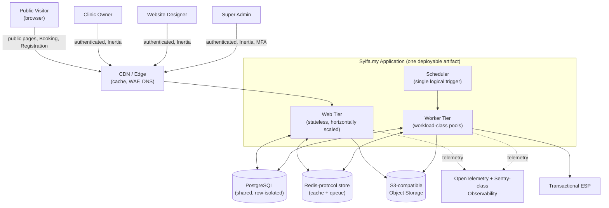
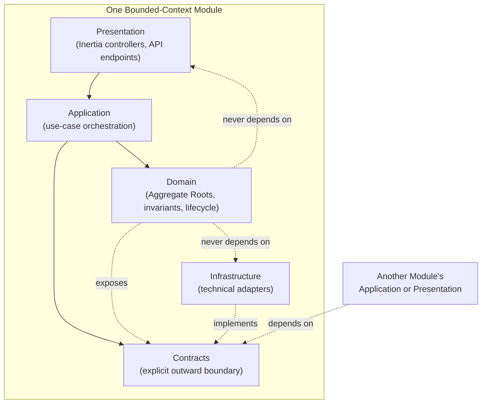
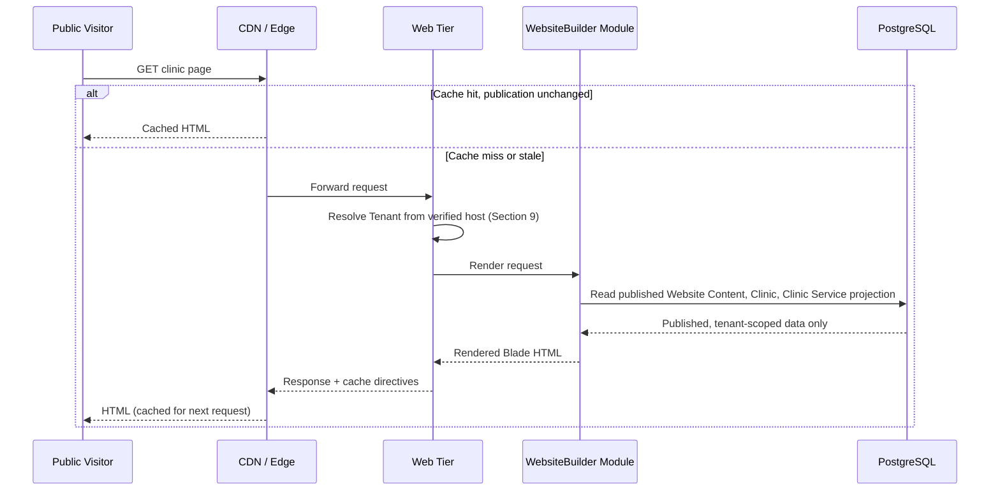
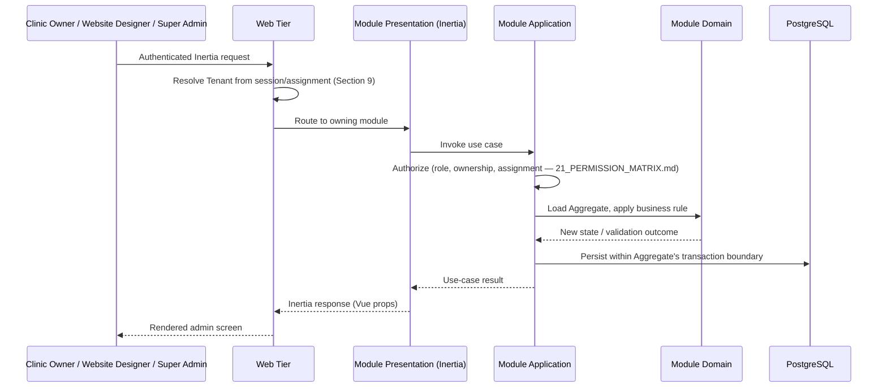
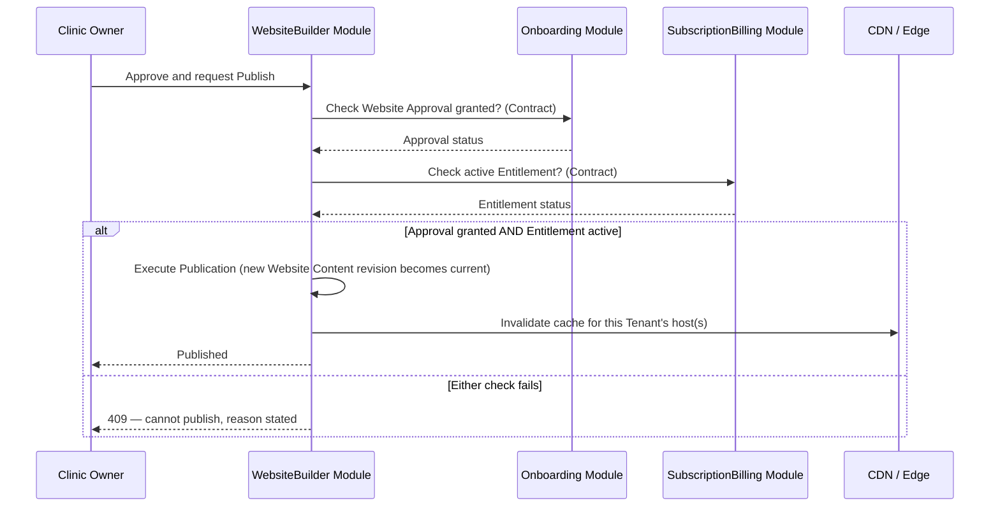
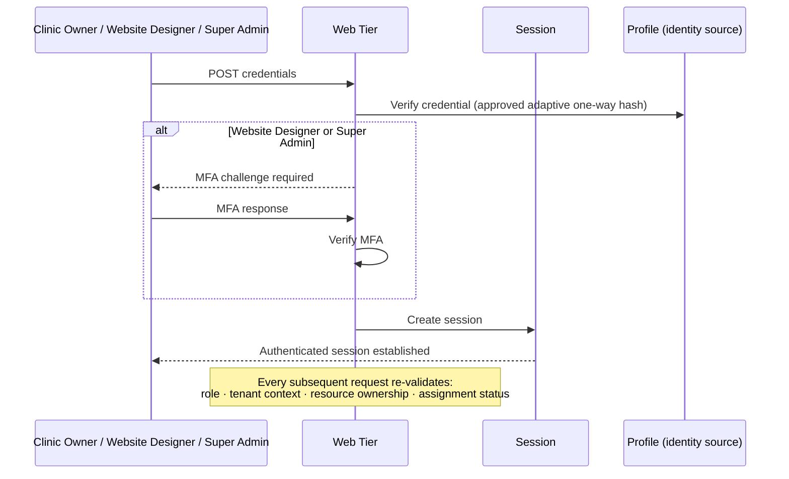
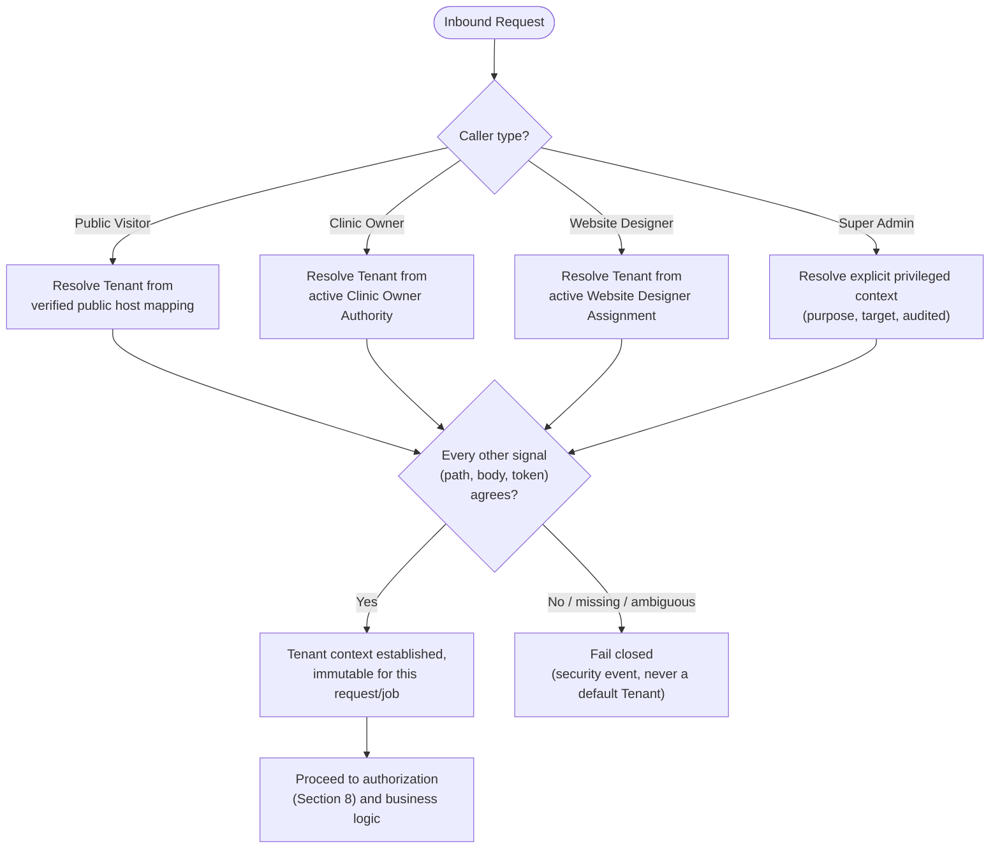
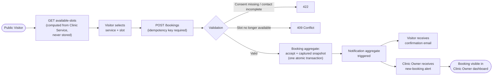
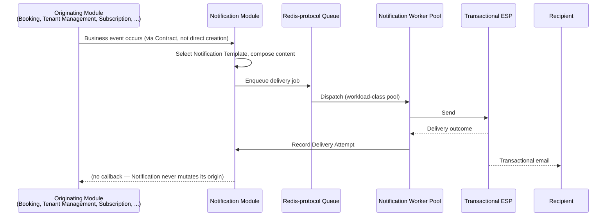
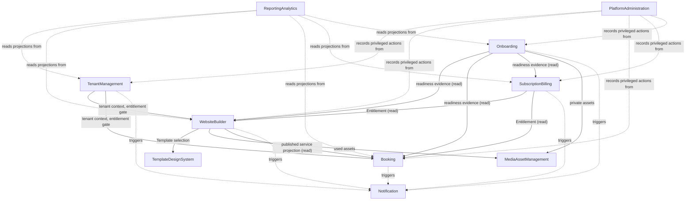

# System Architecture

**Status: Draft — Under CTO Review.** This document is the synthesized production architecture for Syifa.my Phase 1. It explains **how** the platform is structured, using only decisions already locked elsewhere. It introduces no new module, no new Aggregate Root, no microservice, no Kubernetes topology, and no technology not already selected in [ADR-003](./decisions/ADR-003-Technology-Stack.md). It replaces the earlier, deliberately technology-agnostic version of this document, which was written before the Domain Model, Bounded Contexts, Aggregate Design, Database Strategy, API Design, Permission Matrix, ERD, and Technology Stack were locked.

## Table of Contents

- [Document Authority](#document-authority)
- [1. Executive Summary](#1-executive-summary)
- [2. Architecture Principles](#2-architecture-principles)
- [3. High-Level Architecture](#3-high-level-architecture)
- [4. Overall System Diagram](#4-overall-system-diagram)
- [5. Modular Monolith Design](#5-modular-monolith-design)
- [6. Layered Architecture](#6-layered-architecture)
- [7. Request Flow](#7-request-flow)
- [8. Authentication Flow](#8-authentication-flow)
- [9. Tenant Resolution Flow](#9-tenant-resolution-flow)
- [10. Website Rendering Flow](#10-website-rendering-flow)
- [11. Booking Flow](#11-booking-flow)
- [12. Notification Flow](#12-notification-flow)
- [13. Module Interaction](#13-module-interaction)
- [14. Security Boundary](#14-security-boundary)
- [15. Data Ownership](#15-data-ownership)
- [16. Scalability Strategy](#16-scalability-strategy)
- [17. Observability](#17-observability)
- [18. Disaster Recovery Strategy](#18-disaster-recovery-strategy)
- [19. Performance Strategy](#19-performance-strategy)
- [20. Future Evolution](#20-future-evolution)

## Document Authority

This document synthesizes, and does not redecide, the following locked authorities: [01_PRODUCT_VISION.md](./01_PRODUCT_VISION.md) (highest authority), [02_MVP_SCOPE.md](./02_MVP_SCOPE.md), [14_DOMAIN_MODEL.md](./14_DOMAIN_MODEL.md), [15_DOMAIN_CLASSIFICATION.md](./15_DOMAIN_CLASSIFICATION.md), [16_BOUNDED_CONTEXTS.md](./16_BOUNDED_CONTEXTS.md), [18_AGGREGATE_DESIGN.md](./18_AGGREGATE_DESIGN.md), [19_DATABASE_STRATEGY.md](./19_DATABASE_STRATEGY.md), [20_API_DESIGN.md](./20_API_DESIGN.md), [21_PERMISSION_MATRIX.md](./21_PERMISSION_MATRIX.md), [22_ERD.md](./22_ERD.md), [23_AGGREGATE_ROOT_VALIDATION.md](./23_AGGREGATE_ROOT_VALIDATION.md), [24_FOLDER_STRUCTURE.md](./24_FOLDER_STRUCTURE.md), and [ADR-001](./decisions/ADR-001-Architecture-Principles.md), [ADR-002](./decisions/ADR-002-Multi-Tenant-Strategy.md), [ADR-003](./decisions/ADR-003-Technology-Stack.md), [ADR-004](./decisions/ADR-004-Aggregate-Root-Baseline.md). Where this document appears to say something new, it is a synthesis error, not an intended decision — the owning document above always controls.

**A note on Aggregate Root count.** This document uses the fifteen Aggregate Roots confirmed in 18_AGGREGATE_DESIGN.md, independently re-validated in 23_AGGREGATE_ROOT_VALIDATION.md, and formally accepted as the Phase 1 baseline in [ADR-004](./decisions/ADR-004-Aggregate-Root-Baseline.md): Clinic Registration, Tenant, Clinic, Website, Custom Domain, Template, Media, Clinic Service, Booking, Subscription, Payment, Onboarding Job, Notification, Audit Entry, and Platform Setting. A prior revision of 24_FOLDER_STRUCTURE.md stated a narrower, unsupported eleven-item list; ADR-004 formally supersedes that statement, and 24_FOLDER_STRUCTURE.md has been corrected to match this document.

## 1. Executive Summary

Syifa.my Phase 1 is a **modular monolith**: one deployable Laravel/PHP application, organized internally into ten bounded-context modules that each own an explicit slice of the fifteen-Aggregate-Root domain model, deployed as a stateless web tier plus independently scalable background worker pools and a scheduler, all sharing one PostgreSQL database under row-level tenant isolation. Public clinic websites are server-rendered for speed, accessibility, and cacheability; the three authenticated experiences (Clinic Owner, Website Designer, Super Admin) are delivered through a Vue 3 + Inertia.js reactive layer bridged into the same application, so the platform ships as one artifact with one release process rather than a constellation of independently deployed services.

Every structural claim in this document — which module owns which aggregate, which layer may depend on which, how a request resolves its tenant, how a Booking is accepted without conflict — restates a decision already made and approved in the documents listed above. This document's only original contribution is showing how those decisions compose into one working system.

## 2. Architecture Principles

This architecture is evaluated against ADR-001's twelve principles, now applied concretely rather than abstractly:

| Principle | Concrete Expression in This Architecture |
|---|---|
| Platform First | One shared codebase, one shared PostgreSQL topology, one shared Template catalogue — no Tenant receives a code fork, a dedicated deployment, or a bespoke schema. |
| Product Before Technology | Every technology in ADR-003 was chosen against a requirement already stated in the Domain Model, API Design, or Database Strategy — never chosen first and justified after. |
| Business Driven Architecture | Module boundaries (Section 5) map to bounded contexts, not technical layers; cost and hiring fit were explicit decision criteria in ADR-003. |
| Modular Thinking | Ten bounded-context modules, each with an explicit `Contracts/` boundary, are the unit of ownership — not a technical layer, not a database table. |
| Scalability Principles | Web tier and worker tier scale independently and by workload class (Section 16); tenant count alone is never treated as a sufficient capacity model. |
| Maintainability Principles | Dependency direction is enforced one way only (Section 6); a module's `Infrastructure/` is private and swappable behind its own `Contracts/`. |
| Security By Design | Tenant context is a fail-closed security boundary evaluated before any tenant-owned data is touched (Sections 9, 14), not a filter applied after. |
| Configuration Before Customization | Theme, SEO, and marketing-tracking configuration are governed value clusters on Website, never tenant-authored code (19_DATABASE_STRATEGY.md). |
| Shared Platform Philosophy | One Template catalogue, one Notification pipeline, one Audit Entry stream serve every Tenant identically. |
| Multi-Tenant Mindset | Every tenant-owned Aggregate Root carries explicit tenant ownership (22_ERD.md); every request path resolves tenant context before touching it (Section 9). |
| Design System Philosophy | Five governed Templates plus a shared component design system (07_UI_UX_DESIGN_SYSTEM.md) — not five forks. |
| Operational Excellence | Observability, backup, and recovery are architectural properties from day one (Sections 17–18), not deferred to an operations team after launch. |

## 3. High-Level Architecture

| Component | Responsibility | Technology (ADR-003) |
|---|---|---|
| **Public Website** | Server-rendered clinic pages: identity, services, practitioners, locations, booking calls to action. | Blade templates, layered HTTP/CDN caching (Decision 4). |
| **Admin Application** | Authenticated Clinic Owner, Website Designer, and Super Admin experiences: dashboards, content editing, onboarding workflow, portfolio views. | Vue 3 mounted via Inertia.js, sharing the same deployable artifact as the public website (Decision 3). |
| **API Layer** | The narrow, genuinely interactive surface: Booking submission and availability, Clinic Registration submission, and the in-process contract the Inertia-mounted admin frontend calls. | Contract-first REST-style HTTP JSON per 20_API_DESIGN.md (Decision 5). |
| **Application Layer** | Use-case orchestration per module: sequencing domain calls, enforcing authorization, coordinating a single aggregate's transaction. | Laravel Application classes inside each module's `Application/` folder. |
| **Domain Layer** | Aggregate invariants, business rules, lifecycle transitions — the fifteen Aggregate Roots and their composed internal entities. | Framework-independent domain code inside each module's `Domain/` folder. |
| **Infrastructure Layer** | Technical adapters implementing each module's `Contracts/`: persistence, object storage, mail, search. | Laravel/Eloquent, PostgreSQL client, S3-compatible SDK, mail transport. |
| **Database** | The single shared, row-isolated source of transactional truth. | PostgreSQL, latest stable major version (Decision 8). |
| **Storage** | Tenant and platform Media assets, referenced by identifier, never embedded. | S3-compatible object storage API, vendor deferred (Decision 12). |
| **Notification** | Transactional-only delivery of Notification aggregate instances. | A transactional-only ESP behind a swappable mail abstraction (Decision 14). |
| **Queue** | Asynchronous execution of side effects moved out of the request/response cycle. | A Redis-protocol-compatible store (Redis or Valkey) via the framework queue abstraction (Decision 10). |
| **Cache** | Derived, disposable, tenant-scoped and public-page data, never a source of truth. | The same Redis-protocol-compatible store, plus CDN-edge caching for public pages (Decisions 9, 22). |

## 4. Overall System Diagram



## 5. Modular Monolith Design

### Why Modular Monolith

03_SYSTEM_ARCHITECTURE.md's predecessor already proposed this style; ADR-003's Decisions 19 and 21 confirm it by deliberately deferring full container orchestration and keeping the hosting layer cloud-agnostic rather than defaulting to a distributed topology. The reasoning is unchanged and now concrete: Phase 1 has one small delivery team, one deployable artifact requirement (10_DEPLOYMENT_STRATEGY.md's "build once, promote"), and no measured scaling, reliability, or ownership pressure that ADR-001's extraction criteria would require before splitting a module into an independent service. A modular monolith gives transactional simplicity and delivery speed today while the explicit `Contracts/` boundary (Section 6) keeps a future extraction possible without a rewrite, should evidence ever demand it (Section 20). This document does not introduce microservices or Kubernetes — both remain deliberately deferred, exactly as ADR-003 left them.

### Module Ownership

Each of the ten bounded contexts from 16_BOUNDED_CONTEXTS.md owns an explicit, non-overlapping subset of the fifteen Aggregate Roots:

| Module (`app/Modules/<Context>/`) | Bounded Context | Owned Aggregate Root(s) |
|---|---|---|
| `TenantManagement` | Tenant Management | Clinic Registration, Tenant |
| `WebsiteBuilder` | Website Builder | Clinic, Website, Custom Domain |
| `TemplateDesignSystem` | Template & Design System | Template |
| `MediaAssetManagement` | Media & Asset Management | Media |
| `Booking` | Booking | Clinic Service, Booking |
| `SubscriptionBilling` | Subscription & Billing | Subscription, Payment |
| `Onboarding` | Onboarding | Onboarding Job |
| `Notification` | Notification | Notification |
| `ReportingAnalytics` | Reporting & Analytics | None owned — consumes read-only projections from every other module; Report itself is a projection, never a stored Aggregate Root (15_DOMAIN_CLASSIFICATION.md). |
| `PlatformAdministration` | Platform Administration | Audit Entry, Platform Setting |

Every Aggregate Root has exactly one owning module. No module owns part of another module's aggregate, and no aggregate is split across two modules' `Domain/` folders.

### Communication Rules

A module may only be reached by another module through its `Contracts/` folder — never through direct calls into another module's `Domain/`, `Application/`, or `Infrastructure/`. This is the same rule 24_FOLDER_STRUCTURE.md already locks and 18_AGGREGATE_DESIGN.md's Aggregate Interaction Rules already require at the domain level: reference by identifier only, never an embedded object graph, and never a write that reaches across a module boundary. Onboarding's cross-cutting need to read Website, Clinic Service, Subscription, Custom Domain, and Media as readiness evidence (18_AGGREGATE_DESIGN.md) is satisfied entirely through those modules' own `Contracts/`, never by Onboarding reaching into their `Domain/` directly.

### Dependency Rules

1. `Domain/` must not depend on `Infrastructure/` or `Presentation/`.
2. `Application/` may depend on its own `Domain/` and the `Contracts/` needed to execute a use case.
3. `Infrastructure/` implements contracts; it does not own or redefine business invariants.
4. `Presentation/` invokes `Application/` use cases; it never bypasses them to reach persistence.
5. Cross-module communication uses the providing module's `Contracts/` boundary exclusively.
6. No module queries, imports, or mutates another module's persistence implementation directly.
7. A dependency cycle between modules is prohibited; if two modules appear to need each other's internals, the contract or workflow ownership is wrong and must be redesigned before implementation, not worked around.

---

## 6. Layered Architecture

Within every module, dependency flows one direction only:

```text
Presentation
     │
     ▼
Application
     │
     ▼
   Domain
     │
     ▼
Infrastructure
```

`Contracts/` is not a fifth layer in this flow — it is the narrow, explicit publication surface that `Domain/` and `Application/` expose outward, and the only thing `Infrastructure/` (via implementation) and other modules (via consumption) are permitted to see of this module from outside.



- **`Domain/`** owns the module's business language, invariants, and Aggregate Root behavior. It has no knowledge of HTTP, Eloquent, queues, or any other delivery or persistence mechanism — its purpose is to keep business decisions stable while technical mechanisms change underneath it.
- **`Application/`** coordinates one use case at a time: it loads or creates the relevant Aggregate Root, invokes its Domain behavior, and uses `Contracts/` for anything it needs from another module. It never becomes a second home for business rules and never reaches directly into another module's `Infrastructure/`.
- **`Contracts/`** is the only approved path for another module to depend on this one. It is owned by the module it belongs to, expressed in business language, and never exposes a persistence detail (per 18_AGGREGATE_DESIGN.md's "reference by identifier only" rule, restated as a code-organization rule here).
- **`Infrastructure/`** implements the technical adapters `Contracts/` and `Application/` need — PostgreSQL access, S3-compatible storage calls, mail transport. It owns no business rule; replacing an adapter must never require rewriting `Domain/`.
- **`Presentation/`** translates an authorized inbound request (an Inertia page visit, an API call) into an `Application/` use case, and translates the outcome back for the caller. It never implements a business rule and never reaches past `Application/` into `Domain/` or `Infrastructure/` directly.

## 7. Request Flow

### Public Website Request



Draft, unpublished, suspended, or authorization-sensitive content never enters this path — only an explicit Publication state makes a Website's content reachable here (18_AGGREGATE_DESIGN.md's Website invariant; ADR-002's public-cache isolation rule).

### Admin Request



### Booking Request

Summarized here; the full lifecycle is detailed in Section 11. A Public Visitor's `POST /bookings` (20_API_DESIGN.md) resolves tenant context from the verified public host, checks live availability against the Clinic Service aggregate, and commits the Booking atomically with its own conflict check — never sharing a transaction with Clinic Service's own configuration boundary (18_AGGREGATE_DESIGN.md's Booking aggregate definition).

### Publishing Flow



Both checks are read-only calls through the owning module's `Contracts/` — WebsiteBuilder never reaches into Onboarding's or SubscriptionBilling's `Domain/` to evaluate them itself, and neither check is cached as owned Website state (18_AGGREGATE_DESIGN.md).

---

## 8. Authentication Flow

Framework-native, session-based authentication (ADR-003, Decision 6) — no external Identity-as-a-Service. Public Visitors never authenticate at all, per the locked role model.



**Login.** Credential submission is rate-limited and enumeration-resistant (06_SECURITY_STANDARD.md); Website Designer and Super Admin sessions require a completed MFA challenge before privileged capability is reachable.

**Session.** Established once, then carried per request; never trusted to imply tenant context or authorization by itself — those are re-evaluated on every protected action (21_PERMISSION_MATRIX.md's deny-by-default posture).

**Authorization.** Framework-native, aggregate-scoped policy classes (ADR-003, Decision 7) evaluate actor, tenant context, resource ownership, lifecycle state, and entitlement for every protected operation — never inferred from route visibility or client state.

**Permission.** The specific action-by-action grants in 21_PERMISSION_MATRIX.md's Resource and Role Permission Matrices are the enforced contract; a policy class's decision must trace back to a specific cell in that matrix.

**Tenant Resolution.** Detailed in Section 9 — authorization is only ever evaluated *after* tenant context is independently and safely established, never derived from the same signal being authorized.

## 9. Tenant Resolution Flow

Tenant context is a fail-closed security boundary (ADR-002), resolved through a different trusted path per caller type, never inferred from a client-supplied identifier:



Once established, tenant context propagates unchanged through the rest of the request — into authorization decisions, transactions, cache keys, queued jobs, file metadata, logs, and audit correlation — and is cleared at the end of the request or worker unit so a reused process never inherits a previous Tenant's context (ADR-002).

## 10. Website Rendering Flow

Two rendering paths coexist deliberately, matching 07_UI_UX_DESIGN_SYSTEM.md's distinct experience domains and ADR-003's Decisions 3–4:

| Path | Technology | Why |
|---|---|---|
| Public clinic pages | Blade, server-rendered, layered HTTP/CDN caching | Content must be usable without JavaScript execution, crawlable, and fast on constrained devices and networks — a JavaScript-dependent render path would compromise accessibility and SEO for no benefit, since public content is not interactive in the way admin screens are. |
| Clinic Owner / Website Designer / Super Admin screens | Vue 3, mounted via Inertia.js | These are task-focused, componentized, frequently-interactive workflows (multi-step onboarding review, dashboards, content editors) that benefit from client-side reactivity; Vue was chosen over React specifically for Malaysia-hiring-pool and Laravel-ecosystem fit (ADR-003, Decision 3's dedicated comparison). |
| The bridge between them | Inertia.js | Avoids standing up and versioning a fully separate API-plus-SPA surface purely for first-party admin screens; one deployable artifact, one release process, server-side routing and authorization reused directly (ADR-003, Decision 3). |

A request never mixes the two paths: an unauthenticated request to a public route always renders Blade; an authenticated request to an admin route always renders through Inertia. The one deliberate crossover is Booking's live-availability and submission interaction, which is JSON-API-driven (20_API_DESIGN.md) even though the surrounding page is Blade-rendered — a small, explicitly scoped exception, not a blending of the two rendering models.

## 11. Booking Flow

The one workflow explicitly designed as a business process, not CRUD (18_AGGREGATE_DESIGN.md, 20_API_DESIGN.md, 21_PERMISSION_MATRIX.md all agree on this framing):



- **Visitor.** Public Visitor, unauthenticated, resolved to a Tenant only through the verified public host (Section 9).
- **Booking.** The accept-and-commit step is one atomic transaction scoped entirely to the Booking aggregate, checked against the single-capacity rule; it never shares a transaction with the Clinic Service aggregate whose availability it reads (18_AGGREGATE_DESIGN.md).
- **Validation.** Consent and minimum contact information are enforced at the boundary; the conflict check is enforced inside the Booking aggregate's own transaction, not as a separate step that could race.
- **Notification.** Triggered as a downstream event from Booking's own success — never the other way around; a failed Notification never blocks or reverses the Booking itself (18_AGGREGATE_DESIGN.md's "Notification originates no business truth of its own").
- **Clinic.** The Clinic Owner's own dashboard read is a Tenant-scoped query against the same Booking aggregate — never a separate, potentially-inconsistent copy of the same fact.

## 12. Notification Flow



No role or client ever creates a Notification directly (20_API_DESIGN.md, 21_PERMISSION_MATRIX.md) — every Notification originates from another module's business event, reached only through that module calling the Notification module's `Contracts/`. Delivery runs on its own worker pool, independently scaled from every other workload class (Section 16), so a Notification backlog never degrades Booking's or Publishing's own responsiveness.

---

## 13. Module Interaction



This is the same dependency shape 16_BOUNDED_CONTEXTS.md's own Dependency Matrix and Coupling Analysis already established, redrawn as a module diagram: **TenantManagement** has the highest fan-in (nearly every module depends on it for tenant context) and almost no fan-out of its own. **TemplateDesignSystem** has the fewest inbound dependencies but the widest blast radius when it changes, since every Website depends on its currently selected Template. **WebsiteBuilder** and **Booking** hold the platform's one legitimate bidirectional coupling — Booking supplies the published service projection WebsiteBuilder displays, and WebsiteBuilder supplies the resolved public host Booking needs for tenant context — and this pairing is deliberately not repeated anywhere else in the model. **Notification** and **ReportingAnalytics** are leaves: many modules feed them, neither feeds a business decision back into any other module. **PlatformAdministration** is a governance overlay, not a business dependency — no module routes an ordinary decision through it, only privileged, audited actions.

## 14. Security Boundary

Grounded in ADR-002 and 06_SECURITY_STANDARD.md, restated as architectural properties this system enforces at every layer:

- **Tenant context is a security boundary, not a UI filter.** Every tenant-owned read or write is scoped by the tenant context established in Section 9, re-validated after every object lookup — a record's identifier is never treated as proof of access (ADR-002).
- **Fail closed on ambiguity.** Missing, conflicting, or unverifiable tenant context, role, or assignment halts the request; there is no default Tenant and no permissive fallback.
- **Privileged pathways are structurally separate.** Every Super Admin action requiring an explicit privileged context (Section 9) is reachable only through its own `Presentation/` and `Application/` path — never a Clinic-Owner-facing endpoint with an elevated flag (21_PERMISSION_MATRIX.md's Privilege Escalation Prevention).
- **Website Designer access is assignment-bound and expires immediately.** The moment a Website Designer Assignment ends, every subsequent request under the old grant fails — no residual access window (18_AGGREGATE_DESIGN.md, 21_PERMISSION_MATRIX.md).
- **Audit is mandatory, never optional.** Every privileged or cross-tenant action produces an Audit Entry as an inseparable part of that action succeeding (21_PERMISSION_MATRIX.md's Audit Requirements) — an action is never "successful but unaudited."
- **Public and private caches never mix.** Draft, suspended, or authorization-sensitive content never enters the CDN or shared cache layer; only explicitly published content does (Section 7, ADR-002's cache-isolation rules).
- **Secrets and credentials never transit application code paths in the clear.** Managed through a vendor-neutral secrets system (ADR-003, Decision 18), never committed, never logged, never echoed in a response.
- **MFA gates privileged capability.** Website Designer and Super Admin sessions require completed MFA before privileged actions are reachable (Section 8).
- **Public Visitor cannot infer Tenant existence.** Every Public-Visitor-facing lookup returns the same outcome whether a record exists and belongs to someone else, or does not exist at all (21_PERMISSION_MATRIX.md's Security Principles).

## 15. Data Ownership

Every persisted structure in this system carries exactly one of the ownership classes 19_DATABASE_STRATEGY.md and 22_ERD.md already established:

| Ownership Class | Examples | Rule |
|---|---|---|
| **Tenant-owned** | Clinic Registration, Tenant, Clinic, Website, Custom Domain, Clinic Service, Booking, Subscription, Payment, Onboarding Job, Notification, Media (tenant assets) | Accessible only to that Tenant's own Clinic Owner, an actively assigned Website Designer, and Super Admin through a privileged pathway. Never accessible to another Tenant. |
| **Platform-owned** | Template, Platform Setting, Media (platform assets) | Accessible only to Super Admin, category-scoped where applicable. Clinic Owner and Website Designer have zero standing on any platform-owned resource. |
| **Reference / governed shared data** | Plan, Add-On, Notification Template | Referenced by identifier from consuming aggregates; never copied in as owned state, except where a justified snapshot preserves historical fidelity (Section 11's Booking snapshot is the model case). |
| **Projection / derived data** | Report, Activity Log, Launch Readiness, Booking Opportunity's computed availability | Never a source of truth; rebuildable from owning aggregates at any time; never the basis of a business decision. |
| **Audit / accountability data** | Audit Entry | Platform-owned, append-only, independently protected; access to it is itself an audited event. |

No module ever holds a second, competing copy of a fact another module owns — Website's published-service display is always a read of Booking's own Clinic Service projection, never an independently maintained duplicate (Section 13).

---

## 16. Scalability Strategy

- **Web and worker tiers scale independently.** The stateless web tier scales horizontally behind the CDN/load path; background worker pools scale per workload class (Notification dispatch, Media processing, Onboarding evidence aggregation), so a burst in one never starves another (ADR-003, Decision 24).
- **Tenant count alone is never the capacity model.** Public traffic, booking concurrency, content and media volume, job throughput, and database load are each modeled independently (ADR-002's Resource Fairness and Scale requirements).
- **The database scales through evidence, not speculation.** PostgreSQL on a single well-tuned primary with read replicas is the Phase 1 default; partitioning or a stronger isolation topology is introduced only when measured thresholds justify it (19_DATABASE_STRATEGY.md, ADR-002's hybrid evolution path).
- **Hot Tenants are isolated, not merely accepted.** Rate limits, quotas, and fairness controls apply per Tenant and per workload so one large or noisy Tenant cannot degrade shared capacity for others (ADR-002's noisy-neighbor controls).
- **The CDN absorbs the public traffic that would otherwise reach the application tier at all** (Section 7), meaning application-tier scaling is driven primarily by authenticated concurrency and Booking volume, not raw public page views.

## 17. Observability

- **Instrumentation is vendor-neutral by design.** OpenTelemetry traces and metrics, paired with Sentry-class error tracking (ADR-003, Decision 16), so the backend can change without re-instrumenting application code.
- **Logs are structured, privacy-safe, and correlated** by request/operation, tenant-safe identifier, release, and component (ADR-003, Decision 15) — and are never a substitute for the Audit Entry stream (Section 14).
- **Every runtime path exposes traffic, errors, duration, saturation, queue health, and business-critical outcomes**, per 03_SYSTEM_ARCHITECTURE.md's own architectural driver and 10_DEPLOYMENT_STRATEGY.md's dashboard requirements.
- **A capability does not enter production without dashboards, alerts, and a runbook** (10_DEPLOYMENT_STRATEGY.md's Operational Readiness gate) — observability is a release precondition, not a follow-up task.

## 18. Disaster Recovery Strategy

High-level only; this document does not set numeric recovery objectives, consistent with 10_DEPLOYMENT_STRATEGY.md's own refusal to invent them ahead of an approved business-impact analysis.

- **Database recovery** relies on PostgreSQL's native, WAL-based point-in-time recovery (ADR-003, Decision 26) — mature, standard tooling available from any managed provider or self-hosted deployment, consistent with the cloud-agnostic hosting posture (ADR-003, Decision 21).
- **Tenant-level recovery is a distinct, harder problem than platform-wide backup**, per ADR-002 — a controlled recovery-area and reconciliation process is required before general availability, and platform-wide rollback is never used to correct one Tenant's data, since that would reverse every other Tenant's valid changes in the same window.
- **Object storage recovery** relies on the chosen S3-compatible provider's own durability and versioning guarantees, evaluated as part of the deferred provider selection (ADR-003, Decision 12).
- **Recovery-point and recovery-time objectives are explicitly deferred** to the business-impact analysis 10_DEPLOYMENT_STRATEGY.md requires before general availability — this document does not assume a number.
- **Restore testing, not backup completion, is the acceptance evidence** — a scheduled, evidenced restoration exercise is required before this strategy can be considered proven, not merely configured.

## 19. Performance Strategy

- **Public pages are cache-first.** Layered HTTP and CDN caching (Section 7) means most public traffic never reaches the application tier at all; deterministic cache invalidation on Publication keeps this safe (Section 7's Publishing Flow).
- **Indexing follows verified access patterns, not speculation** (19_DATABASE_STRATEGY.md's Index Strategy) — every index is justified by a real query pattern from the locked Core MVP Journey, reviewed for cardinality, tenant-skew, and write-amplification cost before it is added.
- **Booking's conflict-check path is the platform's most latency-sensitive transaction** and is given a stronger concurrency guarantee than ordinary optimistic locking specifically because of that (Section 11, ADR-003's Optimistic Locking Policy).
- **Non-critical work is always asynchronous.** Notification dispatch, Media processing, and analytics emission never execute inline within a request/response cycle (Section 12; ADR-003, Decision 24).
- **Connection pooling and capacity planning are modeled explicitly**, not assumed — PostgreSQL connection-pool exhaustion under concurrency is a named, monitored risk (ADR-003, Decision 8), not an incident waiting to happen.

## 20. Future Evolution

This architecture is designed to continue scaling **beyond 3,000 clinics without a foundational rewrite** (Product Vision, ADR-001, ADR-002), through evidence-triggered evolution rather than speculative complexity added now:

- **Stronger tenant isolation** — ADR-002's hybrid evolution path allows a hot or legally constrained Tenant to move to dedicated physical placement without changing any aggregate's logical identity or introducing tenant-specific application code, because every cross-aggregate reference in this system is already placement-neutral (22_ERD.md, 19_DATABASE_STRATEGY.md's Future Scalability section).
- **A dedicated message broker or search engine** — both are explicitly named, evidence-gated migration targets in ADR-003 (Decisions 10, 13), not introduced now because current job-routing and search needs are simple; the queue and search abstractions are already swappable behind their existing interfaces.
- **A durable workflow orchestrator for Onboarding Job** — 18_AGGREGATE_DESIGN.md already names Onboarding Job's own workflow complexity as the most likely trigger for this, should multi-step orchestration needs outgrow the framework-native scheduler (ADR-003, Decision 11).
- **Module extraction into independently deployed services** — the explicit `Contracts/` boundary (Sections 5–6) is what makes this possible later without a rewrite, but ADR-001's extraction criteria (a stable contract, clear data ownership, measurable benefit, a migration and rollback path, and an honest accounting of distributed-failure cost) must be met with real evidence first. **This document does not introduce microservices or Kubernetes now** — it preserves the option, which is a different thing.
- **Realtime capability** — latent in the already-provisioned Redis-protocol store's broadcasting support (ADR-003, Decision 25), addable for a specific, evidenced need (for example, live Onboarding Job status) without a new foundational product.
- **Read replicas, partitioning, and archival** — each introduced only from measured database load, per 19_DATABASE_STRATEGY.md and ADR-002, never speculatively.

No item in this section is a Phase 1 commitment. Each requires the same evidence-led review ADR-001 already mandates before it becomes architecture rather than a documented possibility.