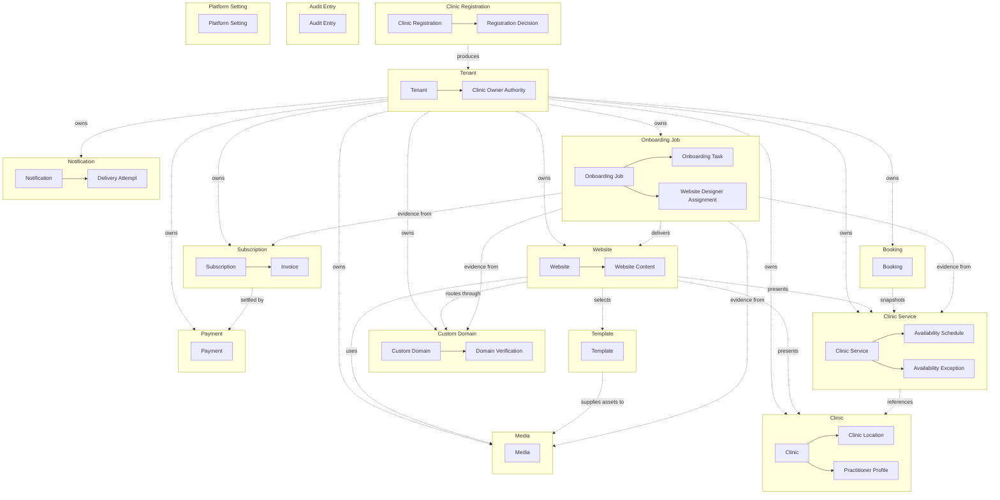

# Entity Relationship Diagram (Logical)

**Status: Current with implementation-alignment note.** This is a **logical** ERD. Amended ADR-013 supersedes historical diagram nodes for Service-owned Availability Schedule/Exception: Clinic owns shared Booking Configuration, while Booking persistence owns Tenant/exact-slot reservation buckets and immutable history. The diagram remains historical until redrawn; this note and textual definitions control conflicts.

## Table of Contents

- [Document Authority](#document-authority)
- [Purpose and Method](#purpose-and-method)
- [Entity Classification Recap](#entity-classification-recap)
- [Per-Aggregate Definitions](#per-aggregate-definitions)
- [Logical ERD](#logical-erd)
- [Aggregate Boundary Diagram](#aggregate-boundary-diagram)
- [Cross-Aggregate References](#cross-aggregate-references)
- [Relationship Principles](#relationship-principles)
- [Forbidden Relationships](#forbidden-relationships)
- [Circular Dependency Analysis](#circular-dependency-analysis)
- [Normalization Strategy](#normalization-strategy)
- [Future Expansion](#future-expansion)

## Document Authority

This document is the authoritative logical entity-relationship model for the originally approved Phase 1 roots, with the SYIFA-085A implementation-alignment note above controlling the CommercialOffer addition until the diagram is redrawn. It applies [19_DATABASE_STRATEGY.md](./19_DATABASE_STRATEGY.md)'s ownership classification and deletion/archive policy to each one, and stays within the vocabulary [14_DOMAIN_MODEL.md](./14_DOMAIN_MODEL.md) already established. It does not replace any of these documents — it is their visual and relational synthesis, produced specifically to satisfy 19_DATABASE_STRATEGY.md's own Future ERD Recommendations ("organize it by aggregate boundary... visually distinguish intra-aggregate composition lines from cross-aggregate identifier references... annotate every structure with its ownership tier").

This document does not authorize a physical schema. No table, column, data type, key, or index is defined here; those require the engine-selection ADR and physical schema design ADR-001 and 19_DATABASE_STRATEGY.md both reserve for later.

## Purpose and Method

A logical ERD answers one question for each pair of business concepts: **is there a relationship, and if so, what kind and what cardinality?** It does not answer *how* that relationship would be physically stored. Three modeling decisions were made deliberately and are stated up front so the diagram is not mysterious:

1. **Only persisted business entities appear.** Projections (Report, Activity Log, Launch Readiness, Booking Opportunity) are explicitly excluded — 15_DOMAIN_CLASSIFICATION.md and 18_AGGREGATE_DESIGN.md already established that none of these are stored sources of truth, and drawing them as ER entities would misrepresent them as data this model owns rather than derives.
2. **Internal entities are shown as their own boxes**, connected to their aggregate root by a composition relationship, because a logical ERD should make cardinality (how many Locations does one Clinic have?) visible even where 18_AGGREGATE_DESIGN.md's aggregate boundary means that entity is never independently addressable from outside its root.
3. **Pure value objects with no independent identity are folded into their owning entity and not drawn as separate boxes** (Booking Contact, Theme, Entitlement, a captured service snapshot). **Value objects that form an append-only history with real one-to-many multiplicity are drawn as weak entities** (Domain Verification, Delivery Attempt), because that multiplicity is genuine business information even though no individual history entry has standalone identity.

## Entity Classification Recap

| Class | Entities | ERD Treatment |
|---|---|---|
| Aggregate Root | Clinic Registration, Tenant, Clinic, Website, Custom Domain, Template, Clinic Service, Booking, Subscription, Payment, Onboarding Job, Media, Notification, Audit Entry, Platform Setting | Full entity box; the unit every relationship ultimately resolves to. |
| Internal Entity (composed, independently addressable) | Registration Decision, Clinic Owner Authority, Clinic Location, Practitioner Profile, Website Content, Availability Schedule, Availability Exception, Onboarding Task, Website Designer Assignment, Invoice | Entity box, connected to its root by a solid composition relationship. Never referenced from outside its own aggregate for write purposes (see Relationship Principles). |
| Value-object history (weak entity) | Domain Verification, Delivery Attempt | Entity box shown for multiplicity only; explicitly has no identity beyond (parent, sequence). |
| Reference Data (platform-owned catalogue) | Plan, Add-On, Notification Template | Entity box; referenced by dashed (non-identifying) relationships only, never composed. |
| Excluded — Projection/derived | Report, Activity Log, Launch Readiness, Booking Opportunity | Not shown. Computed or derived; never a stored source of truth (18_AGGREGATE_DESIGN.md). |
| Excluded — pure value object (no independent multiplicity) | Booking Contact, Theme, Entitlement, captured service/location/practitioner snapshot | Not shown as a separate box; folded into the owning entity, noted in that aggregate's prose definition. |
| Excluded — no persisted consumer in this model | Metric Definition | Not shown. Its only consumer, Report, is itself excluded as a projection. |

The original diagram contains thirty entities: fifteen aggregate roots, ten internal entities, two weak history entities, and three reference-data entities. The current registry adds CommercialOffer as the sixteenth Aggregate Root; the next ERD revision must add its logical relationships explicitly.

## Per-Aggregate Definitions

---

### 1. Clinic Registration

- **Purpose:** Protects a prospective clinic's admission workflow before any Tenant exists.
- **Owned Entities:** Registration Decision (composed internal entity, one or more over the correction cycle).
- **Relationships:** Produces one Tenant on approval — a one-time transition, not an ongoing reference.
- **Ownership:** Tenant-owned, scoped to the prospective Tenant it will produce; exists in a pre-Tenant state.
- **Cardinality:** One Clinic Registration produces zero or one Tenant (0..1); one Clinic Registration composes many Registration Decisions over its lifecycle, though only one is ever current/final.
- **Composition:** Registration Decision is composed within Clinic Registration — no independent lifecycle.
- **Reference:** No inbound reference before approval; produces a Tenant identifier on approval, never composes it.
- **Lifecycle Dependency:** Fully independent — completes its own lifecycle before any other aggregate is created from it.
- **Deletion Behaviour:** Never deleted; retained as historical admission record. Withdrawal and rejection are lifecycle states, not deletions.
- **Archive Behaviour:** Decided-and-aged Registrations may be archived by Super Admin, non-destructively.
- **Business Constraints:** Exactly one approved Registration produces exactly one Tenant, never duplicated by a repeated transition attempt; only one Registration Decision is current/final at a time.

### 2. Tenant

- **Purpose:** The stable security, ownership, and lifecycle boundary for one contractual clinic organization.
- **Owned Entities:** Clinic Owner Authority (composed, one active plus historical entries over time).
- **Relationships:** References/is-referenced-by Clinic, Subscription, Website, Custom Domain, Clinic Service, Booking, Onboarding Job, Media (tenant assets), Notification (tenant-scoped), Payment, and Audit Entry (scope).
- **Ownership:** The security boundary itself; platform-governed.
- **Cardinality:** One Tenant to exactly one Clinic (Phase 1 lock); one Tenant to many of nearly every other tenant-owned aggregate.
- **Composition:** Clinic Owner Authority composed within Tenant.
- **Reference:** Referenced by nearly every tenant-owned aggregate; Tenant itself carries no other stored reference beyond its own Clinic Owner Authority.
- **Lifecycle Dependency:** Depends on an approved Clinic Registration to exist; every other tenant-owned aggregate depends on Tenant existing first.
- **Deletion Behaviour:** Never hard-deleted under ordinary operation; deleted or anonymized only at the end of an approved, legally reviewed retention period — anonymization is preferred over hard deletion where dependent Audit Entry or financial records must survive.
- **Archive Behaviour:** Not archived as a single boundary; each owned aggregate archives individually under its own rule.
- **Business Constraints:** The Tenant identifier is immutable regardless of name, domain, owner, or Subscription changes; Clinic Owner Authority for one Tenant never implies authority for another.

### 3. Clinic

- **Purpose:** The authoritative, Clinic-Owner-approved business identity presented and operated through Syifa.my.
- **Owned Entities:** Clinic Location (zero or many), Practitioner Profile (zero or many).
- **Relationships:** References Tenant (owner). Referenced by Website (presentation), Clinic Service (catalogue context), Onboarding Job (evidence).
- **Ownership:** Tenant-owned.
- **Cardinality:** One Clinic to exactly one Tenant; one Clinic to many Clinic Locations; one Clinic to many Practitioner Profiles.
- **Composition:** Clinic Location and Practitioner Profile are composed within Clinic.
- **Reference:** References only Tenant; referenced by Website, Clinic Service, and Onboarding Job.
- **Lifecycle Dependency:** Created as a side effect of Clinic Registration approval; cannot outlive its Tenant.
- **Deletion Behaviour:** Never independently deleted; removal is part of governed Tenant offboarding only.
- **Archive Behaviour:** Long-offboarded Clinics may be archived by Super Admin, non-destructively.
- **Business Constraints:** A Clinic Location or Practitioner Profile can never be reassigned to another Clinic (doing so would cross a Tenant boundary); retiring one must not rewrite historical Booking meaning.

### 4. Website

- **Purpose:** The Tenant's managed public digital presence.
- **Owned Entities:** Website Content (zero or many pages).
- **Relationships:** References Tenant (owner), Clinic (presented facts), Template (selected), Custom Domain (current attachment), Media (used assets), Clinic Service (published, read-only projection consumed for display).
- **Ownership:** Tenant-owned.
- **Cardinality:** One Website to one Tenant (Phase 1 expectation, cardinality beyond one left open per 14_DOMAIN_MODEL.md); one Website to one Template; one Website to zero-or-one active Custom Domain; one Website to many Website Content pages; many Websites to many Media (usage).
- **Composition:** Website Content is composed within Website; Theme and Publication history are value objects folded into Website, not separate entity boxes.
- **Reference:** References Tenant, Clinic, Template, Custom Domain, Media, and Clinic Service, all by identifier.
- **Lifecycle Dependency:** Initialized automatically when its Onboarding Job begins; depends on Tenant and, indirectly, an approved Clinic Registration.
- **Deletion Behaviour:** Never deleted; retirement is a lifecycle state, preserving historical publication fidelity.
- **Archive Behaviour:** Long-retired Websites' content history may be archived, non-destructively.
- **Business Constraints:** Cannot select an unapproved or retired Template; publication requires both a granted Website Approval (Onboarding Job) and active Entitlement (Subscription), checked at the moment of publishing, never cached as owned truth.

### 5. Custom Domain

- **Purpose:** A clinic-controlled public domain routing to an eligible Website.
- **Owned Entities:** Domain Verification (weak, history entity — zero or many attempts).
- **Relationships:** References Tenant (owner), Website (current attachment).
- **Ownership:** Tenant-owned routing asset; underlying legal domain control remains with the domain holder.
- **Cardinality:** One Custom Domain to one Tenant; one Custom Domain to zero-or-one Website (active attachment); one Custom Domain to many Domain Verification attempts.
- **Composition:** Domain Verification is composed (as history) within Custom Domain.
- **Reference:** References Tenant and Website by identifier.
- **Lifecycle Dependency:** Depends on Tenant and, typically, an in-progress Website or Onboarding Job.
- **Deletion Behaviour:** Never deleted; detachment enters a governed quarantine period before the domain is eligible for reassignment.
- **Archive Behaviour:** Detached-domain history is retained for a governed period, then archived non-destructively.
- **Business Constraints:** A public host maps to at most one active Tenant Website platform-wide; a domain must be verified before activation; unique while active.

---

### 6. Template

- **Purpose:** One of the five governed premium website presentation products.
- **Owned Entities:** None.
- **Relationships:** Referenced by Website (selection) and Media (shared platform assets).
- **Ownership:** Platform-owned.
- **Cardinality:** One Template to many Websites (selection); one Template to many Media (shared assets).
- **Composition:** None.
- **Reference:** References nothing (an upstream, platform-authored aggregate); referenced by Website and Media.
- **Lifecycle Dependency:** Independent of any Tenant; governed centrally.
- **Deletion Behaviour:** Never deleted; retired instead, to preserve the historical meaning of any Website that used it.
- **Archive Behaviour:** A deprecated Template remains visible to Websites already using it but is excluded from new-selection listings.
- **Business Constraints:** Exactly five premium Templates exist in locked Phase 1 scope; a structural revision must not silently break an already-published Website using it.

### 7. Clinic Service

- **Purpose:** A tenant-owned service category with public meaning and controlled Booking Form eligibility. Clinic owns shared duration, capacity, hours, and availability.
- **Owned Entities:** None for scheduling.
- **Relationships:** References Tenant, Clinic, Clinic Location (many), Practitioner Profile (many, provisional). Referenced by Website (presentation), Booking (snapshot), Onboarding Job (evidence).
- **Ownership:** Tenant-owned.
- **Cardinality:** One Clinic Service to one Tenant and one Clinic; many Clinic Services to many Clinic Locations; many Clinic Services to many Practitioner Profiles (provisional); one Clinic Service to many Availability Schedules and Exceptions.
- **Composition:** Availability Schedule and Availability Exception are composed within Clinic Service.
- **Reference:** References Clinic Location and Practitioner Profile by identifier — a read-only reference into another aggregate's internal entities (see Relationship Principles for why this is a deliberate, bounded exception, not a violation).
- **Lifecycle Dependency:** Depends on Clinic existing; independent of Booking (a service can exist with zero Bookings).
- **Deletion Behaviour:** Never deleted; retired — stops new booking activity without rewriting historical Bookings, which hold a captured snapshot rather than a live reference.
- **Archive Behaviour:** Rare; volume is low relative to Booking, so independent archival is typically unnecessary.
- **Business Constraints:** Must belong to Tenant and be active/eligible for selection; it owns no duration, capacity, or availability.

### 8. Booking

- **Purpose:** A Public Visitor's accepted request for a specific service and time.
- **Owned Entities:** None with independent identity — Booking Contact is a value object folded into Booking, not a separate box.
- **Relationships:** References Tenant, Clinic Service, Clinic Location, and Practitioner Profile — each as a **captured value snapshot**, not a live reference.
- **Ownership:** Tenant-owned.
- **Cardinality:** One Booking to one Tenant and one Clinic Service (as it existed at the moment of booking); one Booking to exactly one Booking Contact (value, composed).
- **Composition:** Booking Contact is composed within Booking as a value object; the captured service/location/practitioner snapshot is likewise a value, never a live foreign reference.
- **Reference:** Booking captures Service category identity plus Clinic scheduling snapshots so later Service or Clinic configuration changes cannot rewrite history.
- **Lifecycle Dependency:** Depends on a bookable Clinic Service existing at submission time; independent thereafter — a later Clinic Service change never alters an existing Booking.
- **Deletion Behaviour:** Never deleted under any circumstance once accepted — an explicit, non-negotiable invariant. Cancellation and completion are lifecycle states, never removal. Booking Contact's personal-data fields may be anonymized in place without deleting the Booking itself.
- **Archive Behaviour:** Old completed or cancelled Bookings are archived non-destructively once outside the active operational window.
- **Business Constraints:** Submitted plus confirmed occupancy must never exceed the row-locked reservation bucket's Clinic capacity snapshot for the exact Tenant slot interval.

### 9. Subscription

- **Purpose:** A Tenant's ongoing commercial right to use Syifa.my.
- **Owned Entities:** Invoice (zero or many, provisional weight pending confirmation of the approved payment model).
- **Relationships:** References Tenant (owner/customer identity), Plan (followed), Add-On (selected, deferred).
- **Ownership:** Tenant-associated commercial entity.
- **Cardinality:** Many Subscriptions to one Tenant over commercial history, with one current; one Subscription to one Plan at a time; one Subscription to many Invoices.
- **Composition:** Invoice is composed within Subscription.
- **Reference:** References Tenant, Plan, Billing Option, and Add-On (deferred) by identifier; Entitlement is a computed value object folded into Subscription, not a separate box. Plan, Billing Option, Plan Offering, and Capability Catalogue are governed reference data per 28_COMMERCIAL_CATALOGUE_SPECIFICATION.md and are not drawn as entity boxes in this ERD, consistent with how Plan and Add-On were already treated — no structural change to this diagram results from that specification.
- **Lifecycle Dependency:** Depends on an approved Clinic Registration and Tenant.
- **Deletion Behaviour:** Never deleted; commercial history is retained per financial/contractual obligation — cancellation and expiry are lifecycle states, not deletions.
- **Archive Behaviour:** Long-expired or cancelled history is archived non-destructively.
- **Business Constraints:** Follows exactly one Plan at a time; Entitlement changes never retroactively transfer ownership of already-existing tenant-owned data; expiry never triggers immediate destructive deletion.

### 10. Payment

- **Purpose:** An independently reconciled attempt or completed transfer of value.
- **Owned Entities:** None.
- **Relationships:** References Subscription (settles), Invoice (optional, applies to), Tenant (direct, for isolation enforcement).
- **Ownership:** Tenant-associated commercial entity.
- **Cardinality:** Many Payments to one Subscription; many Payments to zero-or-one Invoice; many Payments to one Tenant.
- **Composition:** None.
- **Reference:** References Subscription, Invoice, and Tenant by identifier.
- **Lifecycle Dependency:** Depends on a Subscription or Invoice obligation already existing.
- **Deletion Behaviour:** Never rewritten or deleted once recorded — a correction is a new, linked Payment, never an edit.
- **Archive Behaviour:** Older Payment history is archived non-destructively and remains fully recoverable.
- **Business Constraints:** Once successful, amount and currency are immutable; a successful Payment does not by itself authorize a participant.

---

### 11. Onboarding Job

- **Purpose:** Syifa.my's managed delivery commitment for one Tenant, from commercial eligibility to launch readiness.
- **Owned Entities:** Onboarding Task (zero or many), Website Designer Assignment (one active plus historical entries over time).
- **Relationships:** References Tenant, Website (delivers), Clinic Service (readiness evidence), Subscription (readiness evidence), Custom Domain (readiness evidence), Media (readiness evidence).
- **Ownership:** Tenant-associated, operationally owned by Syifa.my.
- **Cardinality:** One Onboarding Job to one Tenant and one Website; one Onboarding Job to many Onboarding Tasks; one Onboarding Job to many Website Designer Assignments over its history, with at most one active at a time.
- **Composition:** Onboarding Task and Website Designer Assignment are composed within Onboarding Job.
- **Reference:** References Website, Clinic Service, Subscription, Custom Domain, and Media as read-only evidence; Launch Readiness is a computed value, never a stored box.
- **Lifecycle Dependency:** Depends on Tenant provisioning; coordinates but does not own any of the aggregates it references as evidence.
- **Deletion Behaviour:** Never deleted; completion and cancellation are lifecycle states.
- **Archive Behaviour:** Completed Jobs outside the active review window are archived non-destructively.
- **Business Constraints:** Completion requires approved evidence, not merely activity; a Website Designer cannot approve on behalf of a Clinic Owner.

### 12. Media

- **Purpose:** A clinic or platform visual/document asset used in onboarding, website presentation, or governed communication.
- **Owned Entities:** None.
- **Relationships:** References Tenant (owner, for tenant assets) **or** Template (for platform-owned shared assets) — mutually exclusive per record, never both.
- **Ownership:** Tenant-owned (clinic assets) or platform-owned (shared Template assets).
- **Cardinality:** Many Media to one Tenant, or many Media to one Template (mutually exclusive); many Websites to many Media (usage).
- **Composition:** None.
- **Reference:** References Tenant or Template by identifier, never both on the same record.
- **Lifecycle Dependency:** Independent — can exist before being referenced by Website Content or an Onboarding Task.
- **Deletion Behaviour:** Hard-deleted only after an orphan check confirms no active reference remains anywhere Media's consumers track usage.
- **Archive Behaviour:** Typically moves to a scheduled-for-purge state rather than being archived — a storage-cost decision, not a business-state one.
- **Business Constraints:** Exactly one unambiguous owner per record; private onboarding assets are never public by default.

### 13. Notification

- **Purpose:** One intended transactional communication and its delivery outcome.
- **Owned Entities:** Delivery Attempt (weak, history entity — zero or many).
- **Relationships:** References Tenant (when tenant-scoped) or holds platform scope; references Notification Template. Correlates to its triggering business event by a generic reference, deliberately not modeled as a fixed relationship (see Relationship Principles).
- **Ownership:** Tenant-owned (tenant activity) or platform-owned (platform-governance activity).
- **Cardinality:** Many Notifications to zero-or-one Tenant; one Notification to one Notification Template; one Notification to many Delivery Attempts.
- **Composition:** Delivery Attempt is composed (as history) within Notification.
- **Reference:** References Tenant and Notification Template by identifier.
- **Lifecycle Dependency:** Triggered by another aggregate's business event; originates no business truth of its own.
- **Deletion Behaviour:** Rendered content may be hard-deleted once outside its retention window; the fact that delivery occurred is retained independently of the content itself.
- **Archive Behaviour:** Delivery history is archived non-destructively — Notification is typically the platform's highest-volume aggregate.
- **Business Constraints:** No duplicate Notification for the same idempotent triggering event; content never mixes one Tenant's recipients or context with another's.

### 14. Audit Entry

- **Purpose:** Append-only, tamper-evident accountability evidence for security-sensitive, privileged, and lifecycle actions.
- **Owned Entities:** None — each entry is itself the atomic unit; "Audit Log" is the conceptual name for the stream, not a separate box.
- **Relationships:** References Tenant (scope, where applicable). Correlates to the affected aggregate and acting participant by a generic reference, deliberately not modeled as a fixed relationship to any one aggregate type.
- **Ownership:** Platform-owned (Audit or accountability data), carrying tenant scope as an attribute where relevant.
- **Cardinality:** Many Audit Entries to zero-or-one Tenant (scope).
- **Composition:** None — an Audit Entry is already the smallest meaningful unit.
- **Reference:** References Tenant, by identifier, for scope only.
- **Lifecycle Dependency:** Independent; may outlive the Tenant or business record it describes, subject to legal hold.
- **Deletion Behaviour:** Never modified or deleted through an ordinary path; removed only at the explicit end of an approved, legally reviewed retention period, subject to any active legal hold — the single most tightly governed deletion path in this model.
- **Archive Behaviour:** Older entries are archived non-destructively; archived entries remain intact and equally protected.
- **Business Constraints:** Append-only and immutable once recorded; access to Audit Entry data is itself recorded as a new Audit Entry.

### 15. Platform Setting

- **Purpose:** An approved, service-wide business policy choice affecting how Syifa.my behaves across every Tenant.
- **Owned Entities:** None.
- **Relationships:** None modeled — Platform Setting is consulted as a policy input by other aggregates at evaluation time, which is a runtime read, not a stored data relationship (see Relationship Principles).
- **Ownership:** Platform-owned.
- **Cardinality:** Not applicable — Platform Setting has no drawn relationship cardinality in this model.
- **Composition:** None. Absorbs what 14_DOMAIN_MODEL.md separately and provisionally named System Setting, per the merge already carried through 15_DOMAIN_CLASSIFICATION.md, 18_AGGREGATE_DESIGN.md, and 19_DATABASE_STRATEGY.md.
- **Reference:** References nothing; conceptually consulted by any aggregate needing to check a governed policy value, but never through a stored relationship.
- **Lifecycle Dependency:** Independent of any Tenant.
- **Deletion Behaviour:** Never deleted; superseded or retired to preserve its own approval history.
- **Archive Behaviour:** Retired Settings are retained, non-destructively, as historical policy record.
- **Business Constraints:** Can never be used to bypass tenant isolation, authorization, Product Vision, or locked MVP scope.

---

## Logical ERD

Solid lines (`--`) are composition — the child has no independent lifecycle outside its parent. Dashed lines (`..`) are reference/association — both sides are independent aggregates or entities, connected only by identifier. No columns, keys, or data types appear anywhere below.

```mermaid
erDiagram
    %% Composition relationships (identifying — solid)
    CLINIC_REGISTRATION ||--o{ REGISTRATION_DECISION : composes
    TENANT ||--o{ CLINIC_OWNER_AUTHORITY : composes
    CLINIC ||--o{ CLINIC_LOCATION : composes
    CLINIC ||--o{ PRACTITIONER_PROFILE : composes
    WEBSITE ||--o{ WEBSITE_CONTENT : composes
    CUSTOM_DOMAIN ||--o{ DOMAIN_VERIFICATION : composes
    CLINIC_SERVICE ||--o{ AVAILABILITY_SCHEDULE : composes
    CLINIC_SERVICE ||--o{ AVAILABILITY_EXCEPTION : composes
    SUBSCRIPTION ||--o{ INVOICE : composes
    ONBOARDING_JOB ||--o{ ONBOARDING_TASK : composes
    ONBOARDING_JOB ||--o{ WEBSITE_DESIGNER_ASSIGNMENT : composes
    NOTIFICATION ||--o{ DELIVERY_ATTEMPT : composes

    %% Reference / association relationships (non-identifying — dashed)
    CLINIC_REGISTRATION ||..o| TENANT : produces
    TENANT ||..|| CLINIC : "has business profile"
    TENANT ||..o{ SUBSCRIPTION : "holds commercial history"
    TENANT ||..o| WEBSITE : "has public presence"
    TENANT ||..o{ CUSTOM_DOMAIN : owns
    TENANT ||..o{ CLINIC_SERVICE : owns
    TENANT ||..o{ BOOKING : owns
    TENANT ||..o{ ONBOARDING_JOB : owns
    TENANT ||..o{ MEDIA : "owns (tenant assets)"
    TENANT ||..o{ NOTIFICATION : "scopes (tenant-triggered)"
    TENANT ||..o{ PAYMENT : "scopes (isolation)"
    TENANT ||..o{ AUDIT_ENTRY : "scopes (where relevant)"

    WEBSITE }o..|| TEMPLATE : selects
    WEBSITE }o..o| CUSTOM_DOMAIN : "routes through"
    WEBSITE }o..o{ MEDIA : "uses assets"
    WEBSITE }o..o{ CLINIC_SERVICE : "presents (read-only)"
    WEBSITE }o..|| CLINIC : "presents business facts"

    TEMPLATE ||..o{ MEDIA : "supplies shared assets"

    CLINIC_SERVICE }o..o{ CLINIC_LOCATION : "offered at"
    CLINIC_SERVICE }o..o{ PRACTITIONER_PROFILE : "associated with (provisional)"

    BOOKING }o..|| CLINIC_SERVICE : "books (captured snapshot)"
    BOOKING }o..o| CLINIC_LOCATION : "at (captured snapshot)"
    BOOKING }o..o| PRACTITIONER_PROFILE : "with (captured snapshot, provisional)"

    SUBSCRIPTION }o..|| PLAN : follows
    SUBSCRIPTION }o..o{ ADD_ON : "selects (deferred)"

    PAYMENT }o..|| SUBSCRIPTION : settles
    PAYMENT }o..o| INVOICE : "applies to"

    ONBOARDING_JOB }o..|| WEBSITE : delivers
    ONBOARDING_JOB }o..o| CUSTOM_DOMAIN : "readiness evidence"
    ONBOARDING_JOB }o..o{ CLINIC_SERVICE : "readiness evidence"
    ONBOARDING_JOB }o..o{ SUBSCRIPTION : "readiness evidence"
    ONBOARDING_JOB }o..o{ MEDIA : "readiness evidence"

    NOTIFICATION }o..|| NOTIFICATION_TEMPLATE : uses
```

**Reading notes:** Every composition line has exactly one parent (the aggregate root) and never crosses an aggregate boundary — this is a direct visual check that 18_AGGREGATE_DESIGN.md's Aggregate Persistence Principles are respected. Every dashed line connects two independent aggregates (or an aggregate to a reference-data entity); none of them ever implies the source aggregate can write to the target. Report, Activity Log, Launch Readiness, and Booking Opportunity do not appear anywhere in this diagram — see Entity Classification Recap for why.

## Aggregate Boundary Diagram

The same entities, grouped visually by aggregate boundary, with cross-boundary references shown as labeled edges between boundaries rather than between individual internal entities — this is the view 19_DATABASE_STRATEGY.md's Future ERD Recommendations specifically asked for ("organize it by aggregate boundary... one cluster per aggregate root").

**Reading notes:** Every arrow crosses a subgraph boundary and is therefore, by construction, a reference — never a composition, since composition only ever appears as a solid arrow strictly inside one subgraph. Tenant is the diagram's highest-fan-in boundary, exactly as 18_AGGREGATE_DESIGN.md's own Coupling Analysis already found. Template and Platform Setting sit apart from the Tenant-owned cluster because they are platform-owned and depend on no Tenant to exist; Platform Setting has no drawn edge at all, consistent with its Relationships field above.

---

## Cross-Aggregate References

Every non-composition relationship in the Logical ERD, consolidated in one place with its snapshot-or-live character stated explicitly.

| Source | Target | Meaning | Cardinality | Snapshot or Live |
|---|---|---|---|---|
| Clinic Registration | Tenant | Produces on approval | 1 : 0..1 | One-time transition, not an ongoing reference |
| Tenant | Clinic | Business profile | 1 : 1 | Live (Clinic stores the authoritative direction; see Circular Dependency Analysis) |
| Tenant | Subscription | Commercial history | 1 : 0..N | Live |
| Tenant | Website | Public presence | 1 : 0..1 | Live |
| Tenant | Custom Domain | Ownership | 1 : 0..N | Live |
| Tenant | Clinic Service | Ownership | 1 : 0..N | Live |
| Tenant | Booking | Ownership | 1 : 0..N | Live |
| Tenant | Onboarding Job | Ownership | 1 : 0..N | Live |
| Tenant | Media | Ownership (tenant assets) | 1 : 0..N | Live |
| Tenant | Notification | Scope (tenant-triggered) | 1 : 0..N | Live |
| Tenant | Payment | Isolation scope | 1 : 0..N | Live |
| Tenant | Audit Entry | Scope, where relevant | 1 : 0..N | Live |
| Website | Template | Selection | N : 1 | Live |
| Website | Custom Domain | Routing | 1 : 0..1 | Live |
| Website | Media | Asset usage | N : N | Live |
| Website | Clinic Service | Published projection for display | N : N | Live, but read-only — Website never writes Clinic Service |
| Website | Clinic | Presented business facts | N : 1 | Live, read-only |
| Template | Media | Shared platform assets | 1 : 0..N | Live |
| Clinic Service | Clinic Location | Offered at | N : N | Live, read-only reference into another aggregate's internal entity |
| Clinic Service | Practitioner Profile | Associated with (provisional) | N : N | Live, read-only, provisional pending booking-semantics approval |
| Booking | Clinic Service | Booked service | N : 1 (at booking time) | **Snapshot** — captured value, never a live reference |
| Booking | Clinic Location | Booked location | N : 0..1 (at booking time) | **Snapshot** |
| Booking | Practitioner Profile | Booked practitioner (provisional) | N : 0..1 (at booking time) | **Snapshot** |
| Subscription | Plan | Followed offering | N : 1 | Live |
| Subscription | Add-On | Selected (deferred) | N : N | Live, provisional |
| Payment | Subscription | Settles obligation | N : 1 | Live |
| Payment | Invoice | Applies to | N : 0..1 | Live |
| Onboarding Job | Website | Delivers | 1 : 1 | Live |
| Onboarding Job | Custom Domain | Readiness evidence | 1 : 0..1 | Live, read-only |
| Onboarding Job | Clinic Service | Readiness evidence | 1 : N | Live, read-only |
| Onboarding Job | Subscription | Readiness evidence | 1 : 1 | Live, read-only |
| Onboarding Job | Media | Readiness evidence | 1 : N | Live, read-only |
| Notification | Notification Template | Content source | N : 1 | Live |

**Deliberately not tabulated:** Notification's and Audit Entry's correlation to their *triggering* aggregate (a Booking, a Subscription action, a Website Approval, and so on) is a loose, generic correlation reference, not a fixed relationship to one specific aggregate type — see Relationship Principles for why this is a deliberate modeling choice, not an omission.

## Relationship Principles

1. **Reference by identifier only, never by embedded object.** Every dashed line in the Logical ERD represents an identifier held by the source, never a copy of the target's data or a navigable object graph — this is 18_AGGREGATE_DESIGN.md's Aggregate Persistence Principles, restated as an ERD rule.
2. **One transaction touches exactly one aggregate.** No relationship in this model implies that writing the source also writes the target in the same transaction; every cross-aggregate effect is eventual, orchestrated by the referencing aggregate's own logic, not by a shared write.
3. **Snapshot, don't subscribe, wherever historical integrity matters.** Booking's three snapshot relationships are the clearest example: a later change to Clinic Service, Clinic Location, or Practitioner Profile must never silently rewrite what a Public Visitor actually booked. Wherever this document labels a reference "Snapshot" rather than "Live," that distinction is load-bearing, not decorative.
4. **An internal entity may be referenced by identity from outside its own aggregate for reading, but never composed, written, or deleted from outside.** Clinic Service's reference to Clinic Location and Practitioner Profile is the one place this model reaches into another aggregate's internal entities — and it is a deliberate, bounded exception: Clinic Service may read a Clinic Location's identity to associate a service with it, but it can never create, edit, or retire that Location; only the Clinic aggregate can. This is stated explicitly because it is the single nuance in this model most likely to be implemented incorrectly if not called out.
5. **Projections are computed, not related.** Report, Activity Log, Launch Readiness, and Booking Opportunity do not appear in this ERD because a projection's relationship to its source data is "derived from," not "related to" — drawing it as an ERD relationship would misrepresent a computation as a stored fact.
6. **Platform Setting is consulted, not related.** No aggregate holds a stored reference to a Platform Setting it depends on; checking a governed policy value is a runtime read against the currently active Setting, not a relationship this model draws, because the *set* of Settings any given aggregate might consult is itself a governance decision, not a fixed schema fact.
7. **A relationship's cardinality reflects business reality, not convenience.** Where 14_DOMAIN_MODEL.md or 18_AGGREGATE_DESIGN.md leaves a cardinality provisional (Website-to-Tenant beyond one, Practitioner-to-Clinic-Service association), this document states it as provisional rather than picking a number for diagrammatic tidiness.

## Forbidden Relationships

The following relationship shapes are explicitly rejected and must never appear in a future physical schema, regardless of implementation convenience:

- **A composition relationship crossing an aggregate boundary.** No internal entity is ever composed by more than one aggregate root, and no aggregate root ever composes another aggregate root — Clinic Service does not compose Clinic Location; it only references it.
- **A relationship that lets two aggregates be written in one transaction.** If a future feature seems to need this, the correct response is to re-examine whether the aggregate boundary is drawn correctly (per 18_AGGREGATE_DESIGN.md's own method), not to add a relationship that spans the transaction.
- **A cross-tenant relationship between two tenant-owned aggregates belonging to different Tenants**, under any circumstance, for any role, including Super Admin — cross-tenant access is a privileged *action*, per 21_PERMISSION_MATRIX.md, never a stored *relationship*.
- **A live reference where this document specifies a snapshot.** Booking referencing live Clinic Service data instead of its own captured snapshot would silently rewrite booking history every time a Clinic Owner edits a service — this is forbidden regardless of how much simpler it might appear.
- **A rigid, single-target relationship modeling Notification's or Audit Entry's "triggering event."** Because the trigger can be any of a dozen different aggregates' events, forcing it into one fixed relationship (for example, a single "Booking ID" field) would either be wrong for every other trigger type or require a different field per possible trigger — both are schema smells this model deliberately avoids by treating the correlation as a generic, loosely-typed reference rather than a modeled ERD relationship.
- **A relationship implying Clinic Owner Authority or Website Designer Assignment spans more than one Tenant.** Both are, by definition and by 18_AGGREGATE_DESIGN.md's own invariant, scoped to exactly one Tenant per relationship instance.
- **A relationship from a Projection treated as if it were a real, related entity.** Report "relating to" the Bookings it summarizes is not drawn here, because a Report is derived output, not a party to a business relationship.
- **Any relationship that would let Website Content duplicate Clinic Service's business meaning** rather than reference its published projection — this is the exact "service duplication" risk 14_DOMAIN_MODEL.md names, and this model's Website-to-Clinic-Service reference exists specifically to prevent it.

## Circular Dependency Analysis

A raw count of graph cycles is not the right test for a business ERD — most real relationship graphs contain multi-directional cycles (Tenant–Website–Custom Domain forms a triangle in this very model) without indicating any actual problem, because ordinary reference relationships are not composition, mandatory creation order, or deletion cascades. This analysis checks the three kinds of cycle that would actually matter, and finds none of them present.

**1. Composition cycles — impossible by construction.** Every composition relationship in this model points from exactly one aggregate root to its own internal entities, and 18_AGGREGATE_DESIGN.md's Aggregate Persistence Principles forbid an internal entity from being composed by, or composing, a different aggregate. A composition cycle would require an internal entity to eventually compose its own ancestor — no such relationship exists anywhere in the Logical ERD.

**2. Mandatory creation-order cycles — none found.** Walking the dependency chain: Clinic Registration must exist before Tenant; Tenant (and, in the same provisioning workflow, Clinic) must exist before Subscription, Website, Custom Domain, Clinic Service, Booking, Onboarding Job, Media (tenant assets), Notification, or Payment; Clinic Service must exist before Booking; Subscription (or an Invoice within it) must exist before Payment. At no point does a later aggregate in this chain need to exist before an earlier one — the dependency graph is a strict directed acyclic graph (DAG) rooted at Clinic Registration, with Template and Platform Setting as separate, Tenant-independent roots. No two aggregates require each other to exist first.

**3. Deletion-cascade cycles — none found, and structurally unlikely to ever occur.** 19_DATABASE_STRATEGY.md's Deletion Matrix means almost nothing in this model is ever hard-deleted — lifecycle states are used instead — which removes most of the surface area where a cascade cycle could even be exercised. Where deletion or anonymization does occur (Tenant end-of-retention, Media orphan-purge, Custom Domain post-quarantine reassignment), the direction is always outward from the aggregate being removed, never back onto an aggregate that referenced it in a way that would require reciprocal cascading.

**The one relationship worth extra scrutiny: Tenant ↔ Clinic.** The Logical ERD draws one line between Tenant and Clinic with 1:1 cardinality, which could visually suggest a bidirectional stored dependency. It is not one: per 18_AGGREGATE_DESIGN.md, **Clinic is the side that stores the reference** ("References its owning Tenant by identifier"), while Tenant's relationship to Clinic is a derived lookup ("find the Clinic whose Tenant reference matches this Tenant"), not a second stored field. A logical ERD correctly shows this as one relationship line regardless of which side would physically store it — but this document notes the distinction explicitly so that a future physical schema does not mistake the diagram for permission to store the reference twice, which would itself create the very risk of drift this analysis is designed to rule out.

**Conclusion: no harmful circular dependency exists in this model.**

## Normalization Strategy

Because this is a logical, column-free ERD, "normalization" here means something more fundamental than 1NF/2NF/3NF column rules: **every business fact has exactly one owning aggregate, and every other appearance of that fact is either a reference or a deliberately justified, historically-scoped snapshot.**

- **Single source of truth per fact.** Clinic Service owns service business behavior; Website only ever holds a read-only, published projection of it — this is the direct resolution of the "service duplication" risk 14_DOMAIN_MODEL.md names, and it is enforced structurally by this model's relationship direction (Website references Clinic Service; Clinic Service never references Website for its own meaning).
- **Snapshotting is the one deliberate, justified form of denormalization in this model**, used exactly once per relevant relationship (Booking's captured service/location/practitioner values) and always for the same reason: preserving historical truth against a fact that is allowed to change later. It is never used for query convenience alone.
- **Reference data is never copied into a consuming aggregate.** Plan, Add-On, and Notification Template are referenced by identifier from Subscription and Notification respectively; their content is read at the moment it matters, not duplicated into the referencing aggregate — except where 19_DATABASE_STRATEGY.md's Lookup Table Policy already calls for a snapshot (a Subscription's billing amount at the moment a Plan's price changes, for example), which is the same justified-snapshot pattern as Booking's, applied to commercial data.
- **Composition is used precisely where an internal entity has no independent business meaning**, and never used merely to avoid drawing a second relationship line — Clinic Location is composed within Clinic because a Location genuinely has no meaning detached from its Clinic, not because it was convenient to nest it.
- **Projections are the model's answer to "don't normalize what shouldn't be a source of truth in the first place."** Rather than trying to keep a Report's numbers consistent with the aggregates it summarizes through some synchronization mechanism, this model simply never stores them — Report is computed fresh, which is a stronger consistency guarantee than any denormalization strategy could offer.

## Future Expansion

The following are named future possibilities from 14_DOMAIN_MODEL.md and 18_AGGREGATE_DESIGN.md, translated into their ERD consequence. None are approved Phase 1 scope; each is listed here so that a future revision of this diagram has a known starting point rather than an improvised one.

| Future Candidate | ERD Consequence if Approved |
|---|---|
| Multiple Websites per Tenant | The Tenant–Website relationship changes from 1:0..1 to 1:0..N; every relationship currently drawn from Website (Template, Custom Domain, Media, Clinic Service, Clinic) would need to be re-scoped per Website instance, not per Tenant. |
| One Customer purchasing for several Tenants | Reintroduces a Customer concept distinct from Tenant (this model deliberately folded Customer into Tenant per 18_AGGREGATE_DESIGN.md) — would add a new aggregate root referenced by many Tenants, a genuine new many-to-one relationship not present today. |
| Practitioner-based booking as an independent resource model | Would likely promote Practitioner Profile from a Clinic-composed internal entity to its own aggregate root with its own availability, changing today's provisional Clinic Service–Practitioner Profile association into a firmer, better-specified relationship. |
| Rooms, equipment, and resource-based capacity | Would require new scheduling resources and remains outside MVP. Clinic slot capacity one to ten requires no Doctor/Room/resource entity. |
| A broader Add-On catalogue | Add-On already appears in this model as reference data; expansion would only deepen its existing relationship to Subscription, not add a new relationship shape. |
| Invoice's full lifecycle confirmed | If Invoice's provisional weight is resolved toward a fuller commercial model, it may warrant promotion from an internal entity of Subscription to its own aggregate root, mirroring Payment's own reasoning in 18_AGGREGATE_DESIGN.md. |
| Public website search | Would introduce a new search-index projection, explicitly excluded from this ERD by the same rule that excludes Report and Activity Log today — it would never be drawn as a related entity even if approved. |
| Dedicated physical isolation for a hot or legally constrained Tenant (ADR-002's hybrid evolution path) | Changes *where* an aggregate's data lives, not its logical relationships — this document's entities and cardinalities are explicitly designed to remain valid unchanged under that evolution, per 19_DATABASE_STRATEGY.md's Future Scalability section. |

No future candidate above is treated as validated by its inclusion in this table — each requires the same Product Vision and scope approval 14_DOMAIN_MODEL.md already demands before any domain redesign.
