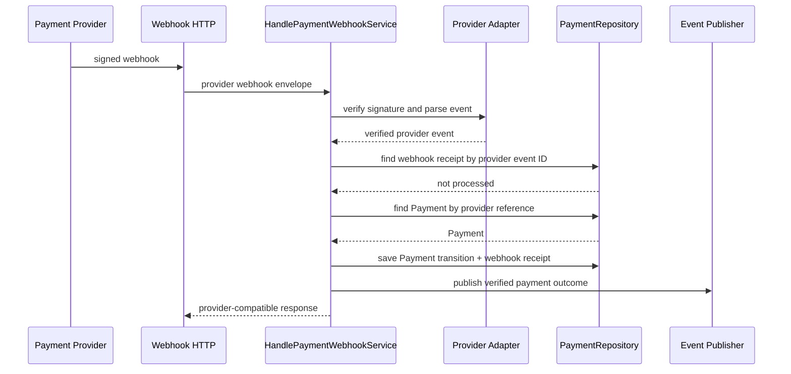
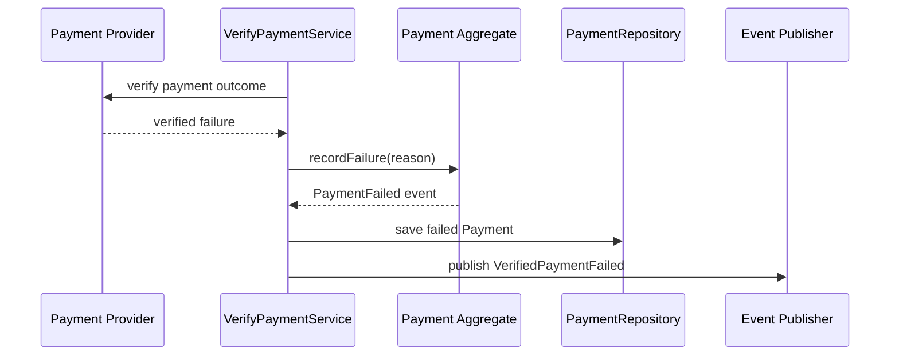
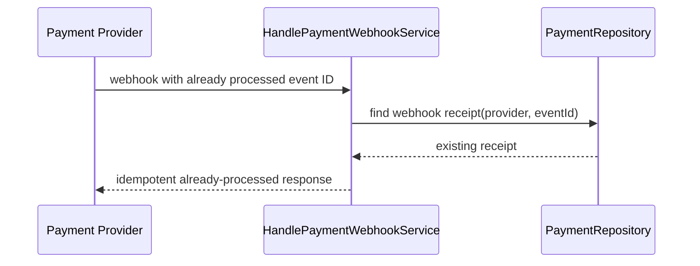
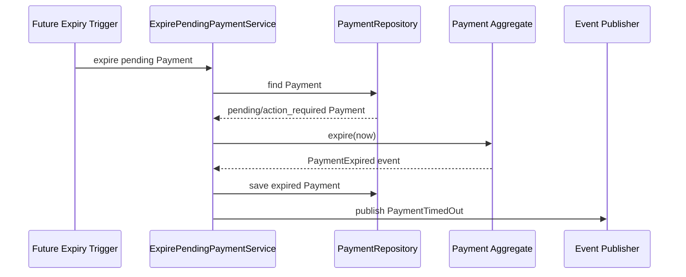

# Payment Architecture Design

## Status

Current provider-neutral architecture design. ADR-008 selects Stripe Malaysia for the Phase 1 Infrastructure adapter without changing the Domain model. ADR-009 subsequently extends the runtime to a registry-based multi-provider architecture (see [docs/33](./33_MULTI_PROVIDER_PAYMENT_ARCHITECTURE.md)); Stripe is one configured adapter alongside ToyyibPay, not the sole runtime provider architecture. ADR-008 remains authoritative for the Stripe-specific evaluation and selection.

## Document Authority

This document designs the Payment architecture for Syifa.my inside the current implementation-aligned architecture. It follows:

- [01_PRODUCT_VISION.md](./01_PRODUCT_VISION.md)
- [03_SYSTEM_ARCHITECTURE.md](./03_SYSTEM_ARCHITECTURE.md)
- [14_DOMAIN_MODEL.md](./14_DOMAIN_MODEL.md)
- [16_BOUNDED_CONTEXTS.md](./16_BOUNDED_CONTEXTS.md)
- [18_AGGREGATE_DESIGN.md](./18_AGGREGATE_DESIGN.md)
- [19_DATABASE_STRATEGY.md](./19_DATABASE_STRATEGY.md)
- [20_API_DESIGN.md](./20_API_DESIGN.md)
- [21_PERMISSION_MATRIX.md](./21_PERMISSION_MATRIX.md)
- [26_ARCHITECTURE_FREEZE_V1.md](./26_ARCHITECTURE_FREEZE_V1.md)
- [ADR-001](./decisions/ADR-001-Architecture-Principles.md)
- [ADR-002](./decisions/ADR-002-Multi-Tenant-Strategy.md)
- [ADR-003](./decisions/ADR-003-Technology-Stack.md)
- [ADR-006](./decisions/ADR-006-Commercial.md)
- [ADR-007](./decisions/ADR-007-Provisioning-Orchestrator.md)
- [ADR-008](./decisions/ADR-008-Phase-1-Payment-Provider.md)
- [ADR-009](./decisions/ADR-009-Multi-Provider-Payment-Infrastructure.md)
- [docs/33_MULTI_PROVIDER_PAYMENT_ARCHITECTURE.md](./33_MULTI_PROVIDER_PAYMENT_ARCHITECTURE.md)

Where this document conflicts with an accepted ADR or the Product Vision, the higher-authority document controls.

## Executive Summary

Payment remains an Aggregate Root owned by the Subscription & Billing bounded context. It records payment execution and reconciliation against an immutable CommercialOffer checkout snapshot prepared by the Commercial context.

Payment does not own pricing, catalogue configuration, CommercialOffer calculation, Subscription activation, Tenant creation, or Internal Onboarding. Payment claims the CommercialOffer through the approved Commercial checkout contract, initiates or verifies a provider payment, records the PaymentAttempt lifecycle, and publishes a verified payment outcome for the Provisioning Orchestrator.

Payment is provider-neutral. Provider details live in Infrastructure behind Payment provider contracts. The Domain records trusted provider references, provider outcomes, and reconciliation evidence without depending on gateway SDKs.

## SYIFA-090A.1 Clarification

SYIFA-090A.1 locks the Commercial-to-Payment handoff terminology as **claimed**.

`claimed` means:

- the CommercialOffer has been exclusively bound to one Payment ID;
- no other Payment may use the same offer;
- the claim is idempotent for the same Payment ID;
- a claim using a different Payment ID conflicts;
- the claim does not mean payment succeeded;
- the claim does not activate Subscription;
- the claim does not provision Tenant;
- the claim does not start Onboarding.

Payment success is represented only by Payment state `succeeded`. Subscription and the Provisioning Orchestrator must consume verified Payment outcomes, never CommercialOffer claim state.

This clarification supersedes the earlier `consumed` terminology used in SYIFA-090A and in current PHP names. SYIFA-090B must migrate implementation terminology to `claimed`, `CommercialOfferClaimed`, and `ClaimCommercialOfferService` before or during Payment Core Foundation.

## 1. Bounded Context

### Owning context

Payment belongs to **Subscription & Billing**.

### Context responsibility

Subscription & Billing owns:

- Subscription lifecycle.
- Subscription entitlement snapshots.
- governed Commercial Catalogue reference data.
- Payment execution and reconciliation.

Payment is distinct from Subscription because payment attempts reconcile asynchronously and may receive out-of-band provider outcomes. Payment must therefore maintain its own lifecycle, idempotency, provider correlation, and immutable financial evidence.

### Upstream dependency

Payment claims:

- CommercialOffer from the Commercial context, through `CommercialOfferCheckoutInterface`.

Payment must not consume or call:

- Plan repository.
- Plan Offering repository.
- Billing Option repository.
- Capability Catalogue repository.
- pricing calculators.
- entitlement computation services.

### Downstream output

Payment produces:

- verified payment outcome events.

The Provisioning Orchestrator consumes those outcomes and decides the next business step. Payment never provisions a Tenant, activates a Subscription, or creates an Onboarding Job directly.

## 2. Aggregate Root

### Aggregate Root

`Payment`

### Purpose

Payment represents one independently reconciled commercial payment process. It protects the invariants around amount, currency, provider correlation, attempt history, idempotent state transitions, and verified outcomes.

### Aggregate identity

`PaymentId`

An opaque platform-generated identifier. API and cross-module contracts must treat it as opaque and must not assume UUID unless the implementation-level standard explicitly selects UUID.

### Aggregate version

`PaymentVersion`

Used for optimistic locking during state transitions and webhook reconciliation.

### Aggregate fields

Payment should contain:

- payment ID.
- CommercialOffer ID.
- clinic registration ID from the CommercialOffer snapshot.
- platform actor identity ID that initiated checkout, if available.
- trusted consumer name used when claiming the CommercialOffer.
- amount in minor units.
- currency.
- provider code.
- provider payment reference.
- idempotency key for the payment request.
- current status.
- attempt history.
- creation timestamp.
- last transition timestamp.
- aggregate version.

### Aggregate invariants

Payment enforces:

- Payment amount and currency come only from CommercialOffer.
- Payment never recomputes, modifies, or recalculates CommercialOffer totals.
- Payment cannot be initiated from an expired, cancelled, or already claimed CommercialOffer unless the claim is for the same Payment ID.
- Payment cannot transition to succeeded unless provider verification succeeds.
- Once succeeded, amount and currency are immutable.
- A failed attempt is never overwritten.
- A retry creates a new PaymentAttempt record under the Payment aggregate.
- A duplicate payment request with the same idempotency key and same payload returns the existing Payment outcome.
- A duplicate payment request with the same idempotency key and incompatible payload is rejected.
- A provider webhook can advance state only if signature verification and replay checks pass.
- A terminal Payment cannot return to a non-terminal state.
- Payment never changes Subscription, Tenant, CommercialOffer pricing, or Onboarding state.

## 3. Entities

### PaymentAttempt

`PaymentAttempt` is an internal entity of the Payment aggregate.

It records one provider-facing attempt to collect the Payment amount.

Fields:

- PaymentAttempt ID.
- provider code.
- provider payment reference.
- provider checkout/session reference, if applicable.
- status.
- requested amount in minor units.
- currency.
- started at.
- provider response recorded at.
- failure reason code, if failed.
- action required details, if provider requires customer action.
- safe provider metadata reference.

Rules:

- PaymentAttempt cannot exist outside Payment.
- PaymentAttempt lifecycle is controlled only by Payment.
- PaymentAttempt mutations participate in the Payment aggregate transaction.
- PaymentAttempt has no independent repository.
- PaymentAttempt is never updated independently of Payment.
- Failed PaymentAttempt records remain part of immutable history.
- Retry creates a new PaymentAttempt.

### ProviderWebhookReceipt

`ProviderWebhookReceipt` is not an entity inside the Payment aggregate.

It is an append-only Infrastructure/Application idempotency record used for provider webhook deduplication, replay detection, processing status, safe processing metadata, and failure diagnostics without secrets. It must not contain business rules belonging to Payment and must not be required when loading a Payment aggregate.

Fields:

- webhook receipt ID.
- provider code.
- provider event ID.
- provider payment reference.
- received at.
- signature verification result.
- replay decision.
- processing outcome.
- safe reason code.

Rules:

- A duplicate provider event ID for the same provider must not be processed twice.
- Invalid signature receipts may be recorded safely without changing Payment state.
- Raw webhook payloads must not be stored by default.
- Sensitive payment instrument data must never be stored.
- The uniqueness boundary is `(provider_key, provider_event_id)`.
- Payment repositories do not reconstruct Payment by loading webhook receipt history.

## 4. Value Objects

Payment should use immutable Value Objects for:

| Value Object | Responsibility |
|---|---|
| `PaymentId` | Opaque Payment identity. |
| `PaymentAttemptId` | Opaque attempt identity. |
| `CommercialOfferReference` | References the CommercialOffer claimed by Payment. |
| `ClinicRegistrationReference` | References the registration associated with the offer. |
| `PaymentMoney` | Minor-unit amount plus currency from CommercialOffer. |
| `PaymentCurrency` | ISO currency code; Phase 1 remains MYR unless commercial governance changes. |
| `PaymentStatus` | Payment aggregate state. |
| `PaymentAttemptStatus` | Individual attempt state. |
| `PaymentProviderCode` | Approved provider identifier. |
| `ProviderPaymentReference` | Opaque provider payment/session reference. |
| `ProviderEventId` | Provider webhook event identifier. |
| `PaymentIdempotencyKey` | Caller-provided idempotency key scoped to actor and operation. |
| `PaymentFailureReason` | Safe failure reason taxonomy. |
| `PaymentVerificationResult` | Provider verification result without provider SDK dependency. |
| `PaymentTimestamp` | UTC instant representation. |

Value Objects must not depend on Laravel, Eloquent, HTTP requests, database rows, provider SDK classes, or environment configuration.

## 5. Repositories

### PaymentRepositoryInterface

Owned by Subscription & Billing Contracts.

Responsibilities:

- find Payment by PaymentId.
- find Payment by idempotency key scope.
- find Payment by provider reference.
- save Payment atomically with optimistic locking.

Repository return types:

- Domain Payment aggregate only.
- No arrays.
- No database rows.
- No Eloquent models.
- No DTOs.

### ProviderWebhookReceiptRepositoryInterface

Owned by Subscription & Billing Contracts, deliberately separate from `PaymentRepositoryInterface` since its return types (a receipt record and a created-or-duplicate result) are not a Domain Payment aggregate and registration must remain resolvable before any Payment match exists.

Responsibilities:

- register receipt of a provider webhook event, atomically detecting a duplicate `(provider_key, provider_event_id)` pair at the database level.
- find a receipt by `(provider_key, provider_event_id)`.

It performs a single atomic statement per call and does not open its own transaction, so a future webhook-orchestration service may call it standalone or nested inside a Payment-transition transaction.

### PaymentReadModelInterface

Optional Application-facing query boundary for future HTTP list/detail views.

Responsibilities:

- list Payment summaries by approved scope.
- get a Payment detail projection.

It returns Contracts DTOs, not Domain objects, and never participates in write transactions.

### Repository boundaries

Payment repository must not:

- write Subscription.
- write Tenant.
- write CommercialOffer.
- write Commercial Catalogue reference data.
- call a payment provider.
- calculate prices.
- compute entitlement.
- write AuditEntry unless invoked through an approved audit boundary in the same application transaction.

## 6. Domain Services

### PaymentStateTransitionPolicy

Pure Domain service that validates legal Payment state transitions.

### PaymentAttemptPolicy

Pure Domain service that decides whether a retry or new attempt can be attached to an existing Payment.

### PaymentVerificationPolicy

Pure Domain service that converts a trusted, provider-neutral verification result into an allowed domain transition.

### WebhookReplayPolicy

Pure Domain service that evaluates whether a provider webhook event has already been processed.

Domain services must not call repositories, application services, gateway SDKs, Laravel services, or HTTP objects.

## 7. Application Services

Each Application service represents one use case.

### InitiatePaymentService

Input:

- CommercialOffer ID.
- idempotency key.
- authenticated PlatformPrincipal.
- correlation ID.

Flow:

1. Load CommercialOffer through `CommercialOfferCheckoutInterface::offerForCheckout`.
2. Reject if no valid checkout snapshot is available.
3. Verify the authenticated PlatformPrincipal owns the relevant Clinic Registration and owns the CommercialOffer being claimed.
4. Check payment idempotency scope.
5. Create or load Payment aggregate.
6. Claim the CommercialOffer for that Payment ID.
7. Create PaymentAttempt inside Payment.
8. Persist Payment.
9. Call Payment Provider through provider abstraction outside the database transaction.
10. Record provider initiation result in Payment.
11. Publish application/domain events after successful Payment transaction.

Design note: if provider session creation must occur before the final Payment state write, the Application service must use a provider-safe idempotency key and reconcile provider reference in a second Payment transaction. It must never hold a database transaction open across a network call.

Phase 1 initiator rule: Payment may be initiated only by an authenticated Platform Identity that owns the relevant Clinic Registration and CommercialOffer. Ownership is derived from the trusted PlatformPrincipal. Client-supplied Platform Identity identifiers must never define ownership.

### VerifyPaymentService

Input:

- Payment ID or provider reference.
- provider verification reference.
- correlation ID.

Flow:

1. Load Payment.
2. Ask provider abstraction for verified status.
3. Apply Payment domain transition.
4. Persist Payment with optimistic locking.
5. Record audit if required by the approved audit policy.
6. Publish verified outcome event.

The durable authoritative-verification increment introduces a narrower `VerifyProviderWebhookReceiptService` before this state-transition service. It atomically claims receipt work, resolves the exact current or historical `PaymentAttempt`, calls that attempt's provider outside a transaction, and stores only normalized verification evidence. It may read Payment to reconfirm ownership but does not invoke transitions, save Payment, publish financial outcomes, or activate Subscription.

`ApplyAuthoritativePaymentVerificationService` consumes that evidence through a separate one-to-one application record. It recalculates attempt currentness inside the Payment transaction. Current legal outcomes mutate Payment; historical non-success is ignored; and authoritative success that cannot legally transition opens an immutable, unique reconciliation case. Payment, system audit, application completion, reconciliation and outbox insertion commit atomically. See [ADR-010](./decisions/ADR-010-Payment-Verification-Application.md).

### HandlePaymentWebhookService

Input:

- provider code.
- raw request envelope.
- correlation ID.

Flow:

1. Verify signature through provider abstraction.
2. Reject invalid signatures without changing Payment state.
3. Check duplicate provider event ID through the append-only webhook receipt boundary.
4. Load Payment by provider reference.
5. Apply verified provider outcome.
6. Persist Payment and webhook receipt atomically where a state transition is applied.
7. Publish verified outcome event if the aggregate state changed.

### RetryPaymentService

Input:

- Payment ID.
- idempotency key.
- actor context.
- correlation ID.

Flow:

1. Load failed or action-required Payment.
2. Validate retry policy.
3. Add new PaymentAttempt.
4. Persist Payment.
5. Call provider abstraction using a provider-safe idempotency key.
6. Record provider initiation outcome.

### GetPaymentService

Read-only query use case for viewing a Payment.

### ListPaymentsService

Read-only query use case for listing Payment history within an approved authorization scope.

Application services must not calculate pricing, activate subscriptions, provision tenants, trigger onboarding directly, or include provider-specific SDK logic.

## 8. Infrastructure

Infrastructure responsibilities:

- PostgreSQL Payment repository implementation.
- persistence mapper for immutable Payment reconstruction.
- storage records for Payment aggregate data, PaymentAttempt history, and webhook receipts.
- provider adapters behind Payment provider interfaces.
- webhook request envelope adapter.
- signature verifier implementation per provider.
- service-provider bindings.
- transaction adapter.
- event publisher adapter.

Infrastructure must not:

- make authorization decisions.
- decide business transitions.
- recompute CommercialOffer totals.
- mutate CommercialOffer except through the approved Commercial checkout contract.
- write Subscription/Tenant/Onboarding state.
- leak provider SDK classes into Domain or Application contracts.

## 9. Payment Provider Abstraction

### PaymentProviderInterface

Provider-neutral operations:

- initiate payment attempt.
- retrieve/verify payment status.
- verify webhook signature.
- parse a verified webhook into provider-neutral data.

### Provider-neutral DTOs

Payment provider contracts should use DTOs such as:

- `ProviderPaymentInitiationRequest`
- `ProviderPaymentInitiationResult`
- `ProviderPaymentVerificationRequest`
- `ProviderPaymentVerificationResult`
- `ProviderWebhookEnvelope`
- `VerifiedProviderWebhookEvent`

These DTOs must expose only safe provider-neutral values:

- provider payment reference.
- provider event ID.
- status.
- amount minor.
- currency.
- action required redirect URL, if applicable.
- safe reason code.
- provider occurrence timestamp.

They must not expose:

- card numbers.
- CVV.
- full wallet credentials.
- access tokens.
- provider secrets.
- raw payloads by default.
- provider SDK objects.

### Provider selection

ADR-008 selects Stripe Malaysia for Phase 1, using hosted Checkout with one-off MYR FPX and Malaysian cards. SYIFA-090C implements that adapter only after the ADR's sandbox capability gate. The selection does not change this provider-neutral contract.

The Domain knows only `PaymentProviderCode`.

Future providers must be added by:

- adding Infrastructure adapters.
- registering provider code in configuration.
- keeping Domain and Application contracts stable.

## 10. Webhook Architecture

### Webhook entry point

The HTTP layer receives provider webhook requests and passes a safe envelope into `HandlePaymentWebhookService`.

Controllers must not:

- validate signatures directly.
- parse provider payloads into domain transitions.
- update Payment state.
- record audit persistence directly.

### Signature validation

Signature validation belongs to the provider Infrastructure adapter. The result is expressed through a provider-neutral verification DTO.

Invalid signatures:

- return a safe provider-compatible response.
- may record a rejected webhook receipt if enough safe identifiers are available.
- never mutate Payment state.

### Duplicate webhook handling

Each verified provider event ID is processed once per provider. Duplicate webhook delivery returns the previous processing outcome and does not repeat state transitions, audit writes, or integration-event publication.

### Replay protection

Replay protection uses:

- provider event ID uniqueness.
- signature timestamp tolerance where the provider supports it.
- received-at timestamp.
- bounded webhook receipt retention.

If a provider lacks event IDs, the adapter must derive a safe deterministic fingerprint from signed provider fields only. That fallback requires explicit implementation approval.

### Webhook response policy

Exact HTTP status mapping may remain provider-adapter-specific, but the semantic policy is fixed:

- invalid signature: reject;
- malformed payload: reject;
- unknown provider event: reject or safely ignore according to the explicit provider adapter contract;
- duplicate valid provider event: acknowledge idempotently;
- already-applied business outcome: acknowledge idempotently;
- transient internal failure: return a retryable failure response;
- no secret, signature, or raw sensitive payload may appear in errors or logs.

### Webhook transaction

Webhook processing uses one Payment aggregate transaction when a business state transition is applied:

1. verify or create the append-only webhook receipt idempotency record.
2. apply Payment transition if legal.
3. save Payment.
4. commit.
5. publish events after commit.

No external provider call should occur inside that transaction unless the provider's signed webhook data is insufficient and a verification call is required; if a verification call is required, it must happen before opening the Payment write transaction.

Authoritative verification is delivered through a durable queue after new receipt persistence. Claiming uses a short atomic PostgreSQL statement and a configured lease; the provider network call runs with no database transaction open. Claim-token-guarded completion prevents a stale worker from writing after lease reclamation. Retry scheduling is durable in both receipt metadata and delayed queue delivery.

## 11. Idempotency

### Payment request idempotency

Payment initiation requires an idempotency key. The key is scoped by:

- operation.
- actor identity or approved caller scope.
- CommercialOffer ID.

Same key and compatible payload:

- returns the existing Payment outcome.

Same key and incompatible payload:

- rejects with an idempotency conflict.

### Webhook idempotency

Webhook idempotency is scoped by:

- provider code.
- provider event ID.

Duplicate events:

- must not create duplicate PaymentAttempt records.
- must not republish duplicate integration events.
- must not duplicate audit entries.

### Retry idempotency

Payment retry uses its own idempotency key. A retry does not modify an earlier failed PaymentAttempt; it appends a new attempt under the same Payment aggregate when the lifecycle permits.

### Duplicate submission

Duplicate user submission against the same active CommercialOffer must not create two chargeable Payment aggregates. The idempotency boundary and CommercialOffer claim boundary together protect against double charging.

### CommercialOffer claim idempotency

CommercialOffer claim idempotency is scoped by:

- CommercialOffer ID.
- Payment ID.

Duplicate claim for the same CommercialOffer ID and same Payment ID:

- succeeds idempotently.

Claim for the same CommercialOffer ID and a different Payment ID:

- fails with conflict.

A claimed CommercialOffer is not payment success. It is only exclusive binding to a Payment ID.

## 12. Payment State Machine

### States

| State | Meaning |
|---|---|
| `draft` | Internal-only Payment aggregate state prepared locally before provider initiation is recorded. It must not be returned as a customer-facing status unless a later ADR explicitly changes this decision. |
| `pending` | Provider payment/session has been initiated and final outcome is not verified. |
| `action_required` | Provider requires customer action before the outcome can be finalized. |
| `succeeded` | Provider outcome has been verified as successful. Terminal. |
| `failed` | Provider outcome has been verified as failed for the current attempt; retry may be permitted. |
| `cancelled` | Payment was cancelled before success. Terminal unless future policy explicitly allows replacement. |
| `expired` | Provider session or platform payment window expired. Terminal for that Payment. |

### Legal transitions

| From | To | Trigger |
|---|---|---|
| `draft` | `pending` | Provider initiation accepted. |
| `draft` | `failed` | Provider initiation rejected with a verified failure. |
| `pending` | `action_required` | Provider requires customer action. |
| `pending` | `succeeded` | Verified provider success. |
| `pending` | `failed` | Verified provider failure. |
| `pending` | `expired` | Provider/platform expiry verified. |
| `action_required` | `pending` | Customer action completed and provider resumes processing. |
| `action_required` | `succeeded` | Verified provider success after action. |
| `action_required` | `failed` | Verified provider failure after action. |
| `action_required` | `expired` | Action window expires. |
| `failed` | `pending` | Approved retry creates a new attempt. |
| `failed` | `action_required` | Approved retry requires customer action. |

### Forbidden transitions

Forbidden:

- `succeeded` to any other state.
- `cancelled` to any other state.
- `expired` to any other state.
- `failed` directly to `succeeded` without a new provider-verified attempt.
- any state to Subscription activation.
- any state to Tenant provisioning.
- any state to Onboarding start.

## 13. Transaction Boundaries

### Aggregate transaction

One Payment state change is one Payment aggregate transaction.

The transaction may write:

- Payment aggregate root record.
- PaymentAttempt internal records.
- append-only webhook receipt idempotency records when processing a webhook.
- AuditEntry only when an approved audit policy requires synchronous transactional audit for that mutation.

The transaction must not write:

- Subscription aggregate.
- Tenant aggregate.
- CommercialOffer aggregate directly.
- OnboardingJob aggregate.
- Commercial Catalogue reference data.

### External provider calls

Provider calls happen outside database transactions whenever possible.

Recommended initiation pattern:

1. create local Payment record as internal `draft`.
2. commit.
3. call provider with idempotency key.
4. record provider result in Payment transaction.

`draft` is internal-only. Public APIs must return `pending`, `action_required`, `failed`, or another customer-facing state, never `draft`, unless a later ADR explicitly changes this decision.

### CommercialOffer claim

Payment claims CommercialOffer through `CommercialOfferCheckoutInterface`.

CommercialOffer claim is a Commercial aggregate lifecycle transition. It is not a Payment repository write. The integration must be idempotent and coordinated by Application services, not by a cross-module database transaction.

### Audit

Payment audit records privileged payment mutations and provider reconciliation decisions.

Audit must not store:

- raw card or wallet data.
- provider secrets.
- session IDs.
- CSRF tokens.
- access tokens.
- full webhook payloads.

### Event publication

Events are published only after the Payment transaction commits.

Financial integration events use `payment_integration_outbox`. Inserting the event is part of the Payment transaction; an independently retryable publisher claims and delivers committed records. Consumers deduplicate by the stable outbox event ID.

If event publication fails after commit, retry/resume belongs to the orchestration/event-delivery mechanism. Payment state must not be rolled back after its own transaction commits.

## 14. Events

### Domain Events

Produced by Payment aggregate behavior:

- `PaymentInitiated`
- `PaymentActionRequired`
- `PaymentSucceeded`
- `PaymentFailed`
- `PaymentExpired`
- `PaymentCancelled`
- `PaymentRetryStarted`
- `PaymentWebhookAccepted`
- `PaymentWebhookRejected`
- `PaymentReconciled`

Domain Events contain:

- Payment ID.
- CommercialOffer ID.
- provider code.
- safe status/outcome.
- occurred-at timestamp.

They must not contain:

- raw provider payload.
- payment instrument details.
- secrets.

### Application Events

Produced by Application services after transaction commit:

- `PaymentInitiationRequested`
- `PaymentVerificationCompleted`
- `PaymentWebhookProcessed`
- `PaymentRetryRequested`

Application Events may include correlation ID, actor identity, idempotency key reference, and safe operational reason codes.

### Integration Events

Published for other modules:

- `VerifiedPaymentSucceeded`
- `VerifiedPaymentFailed`
- `PaymentRequiresAction`
- `PaymentTimedOut`

The Provisioning Orchestrator consumes these events and decides subsequent steps. Subscription consumes only approved orchestration commands or events and still applies Subscription's own invariants. [ADR-011](./decisions/ADR-011-Initial-Subscription-Activation.md) defines the concrete mechanism for `VerifiedPaymentSucceeded`'s consumption by Subscription (a durable `SubscriptionActivationApplication`, never a direct Payment-to-Subscription-repository call) without changing anything in this document about how or when Payment publishes the event.

## 15. Provisioning Integration

Payment integrates with Provisioning Orchestrator through events and contracts.

Flow:

1. Commercial prepares a CommercialOffer.
2. Payment claims the immutable CommercialOffer snapshot for one Payment ID.
3. Payment records provider execution/reconciliation.
4. Payment publishes a verified outcome.
5. Provisioning Orchestrator receives the outcome.
6. Provisioning Orchestrator commands Subscription activation or failure handling as appropriate.

Payment never:

- activates Subscription directly.
- creates Tenant.
- creates Clinic Owner Authority.
- creates OnboardingJob.
- assigns Website Designer.

Per [ADR-011](./decisions/ADR-011-Initial-Subscription-Activation.md), Payment carries a `tenant_id` field — the immutable `TenantId` reserved when Clinic Registration is submitted for the commercial onboarding flow and propagated through the claimed CommercialOffer — so that Subscription activation can revalidate tenant ownership without Payment ever calling into Subscription. This is an additive field, not a change to Payment's existing outcome, verification, or reconciliation behavior described elsewhere in this document. Before Subscription activation is wired, this same increment also adds an `event_version` field (starting at `1`) to `payment_integration_outbox`/`PaymentIntegrationOutboxEvent` — additive integration-contract hardening, not a change to Payment's own outcome or reconciliation behavior.

Provisioning Orchestrator never:

- rewrites Payment state.
- bypasses Payment verification.
- recomputes Payment totals.

## 16. API Surface Design

This document does not implement API endpoints, but future HTTP delivery should align with the existing API design:

- `POST /api/v1/platform/payments` initiates payment.
- `GET /api/v1/platform/payments/{paymentId}` reads payment state.
- `POST /api/v1/platform/payments/{paymentId}/retry` starts a retry if permitted.
- provider webhook endpoints are provider-specific under an implementation-approved path.

Required HTTP controls:

- idempotency key on mutating customer/payment operations.
- RFC7807 problem details.
- no raw payment instrument data.
- no provider secrets in responses.
- no DELETE endpoints.

Webhook endpoints are not public business APIs. They are provider callback endpoints protected by signature validation, replay protection, and provider-specific verification.

## 17. Authorization and Identity

Payment initiation requires an approved actor context from the authenticated runtime. Actor identity must come from server-side identity resolution, never from request body, query string, custom headers, or DTO fields.

Payment history access must be scoped:

- Clinic Owner: own payment records only when tenant/registration ownership has been established by approved identity boundaries.
- Super Admin: privileged operational visibility according to the Permission Matrix.
- Website Designer: no payment mutation authority by default.
- Public Visitor: no payment history access.

Provider webhooks do not authenticate as platform users. They are authenticated by provider signature validation and constrained to provider-neutral webhook handling.

## 18. Persistence Design

Payment persistence belongs to Subscription & Billing.

Future PostgreSQL design should include module-owned storage for:

- payments.
- payment attempts.
- payment webhook receipts.

Required persistence capabilities:

- optimistic locking on Payment aggregate.
- unique idempotency key scope.
- unique provider event ID per provider.
- lookup by provider payment reference.
- immutable attempt history.
- immutable successful amount/currency evidence.
- safe archival without destructive deletion.

No JSON shortcuts for core Payment state, amount, currency, provider references, status, idempotency, or timestamps. Provider metadata may be stored only as safe, bounded metadata if required and explicitly validated.

## 19. Error Model

| Condition | Domain/Application error | HTTP mapping |
|---|---|---|
| CommercialOffer unavailable | Offer not available | `404` or `409` depending on whether identifier exists but is unusable. |
| CommercialOffer expired/cancelled/claimed by another Payment | Invalid offer lifecycle | `409` |
| Idempotency payload mismatch | Idempotency conflict | `409` |
| Provider initiation failure | Payment initiation failed | `502` for provider/infrastructure failure; `422` for business-invalid payment method token. |
| Provider requires action | Payment action required | `202` with action-required state. |
| Provider decline | Payment failed | `202` or `409` depending on endpoint semantics; never `500`. |
| Invalid webhook signature | Webhook rejected | provider-compatible `2xx`/`4xx` policy decided during implementation; no Payment state change. |
| Duplicate webhook | Already processed | idempotent success response with no duplicate side effect. |
| Optimistic lock conflict | Payment version conflict | `409` |
| Infrastructure failure | Platform failure | `500`/`503` with no sensitive details. |

Provider declines are business outcomes, not platform failures.

## 20. Audit Design

Audit coverage is required for:

- payment initiation.
- payment retry.
- payment verification success.
- payment verification failure.
- webhook accepted.
- webhook rejected.
- authorization denial on Payment API endpoints.

Audit actions:

- `payment.initiate`
- `payment.retry`
- `payment.verify`
- `payment.webhook.process`

Outcomes:

- `succeeded`
- `failed`
- `denied`

Safe metadata:

- payment ID.
- CommercialOffer ID.
- provider code.
- provider event ID.
- payment status.
- reason code.
- correlation ID.

Forbidden metadata:

- raw webhook payload.
- raw request payload.
- card data.
- password/credential data.
- tokens.
- cookies.
- session IDs.
- provider secrets.

## 21. Sequence Diagrams

### Customer payment

```mermaid
sequenceDiagram
    participant Actor as Platform Actor
    participant HTTP as Payment HTTP
    participant App as InitiatePaymentService
    participant Commercial as CommercialOfferCheckoutInterface
    participant Repo as PaymentRepository
    participant Provider as PaymentProvider
    participant Events as Event Publisher

    Actor->>HTTP: POST /payments with CommercialOffer ID + idempotency key
    HTTP->>App: initiate payment command
    App->>Commercial: offerForCheckout(offerId, trustedConsumer)
    Commercial-->>App: immutable CommercialOffer snapshot
    App->>Repo: find by idempotency scope
    Repo-->>App: no existing Payment
    App->>Repo: save internal Payment draft / attempt
    App->>Provider: initiate payment with provider idempotency key
    Provider-->>App: provider payment reference / action
    App->>Repo: save provider result
    App->>Commercial: claim(offerId, paymentId, expectedVersion)
    Commercial-->>App: claimed CommercialOffer
    App->>Events: publish PaymentInitiated or PaymentActionRequired
    App-->>HTTP: Payment response
```

### Webhook



### Failure



### Retry

```mermaid
sequenceDiagram
    participant Actor as Actor
    participant App as RetryPaymentService
    participant Repo as PaymentRepository
    participant Payment as Payment Aggregate
    participant Provider as PaymentProvider

    Actor->>App: retry failed Payment with idempotency key
    App->>Repo: find Payment
    Repo-->>App: failed Payment
    App->>Payment: startRetry(new attempt)
    App->>Repo: save Payment with new attempt
    App->>Provider: initiate retry attempt
    Provider-->>App: provider reference / status
    App->>Repo: save provider retry result
```

### Duplicate webhook



### Timeout



## 22. Non-Functional Requirements

### Security

- No raw payment instrument data enters Syifa.my application code.
- Provider tokens and secrets remain in configuration/secrets management, not Domain or persisted metadata.
- Webhooks require signature validation before state transitions.
- Duplicate/replay webhooks are fail-closed.
- Payment endpoints use platform request protection and CSRF/session protection where applicable.

### Privacy

- Store only payment evidence required for reconciliation and customer support.
- Never store patient clinical data in Payment.
- Do not store raw request/webhook payloads by default.

### Operability

- Payment state must be externally reconcilable by provider references.
- Failed and pending states must be observable through safe operational reporting.
- Provider failures must be distinguishable from customer declines.

### Scalability

- Payment processing remains within the modular monolith.
- Provider adapters can be added without Domain changes.
- Webhook handling must be idempotent under repeated delivery.

### Reliability

- No database transaction should be held open during provider network calls.
- Optimistic locking protects concurrent webhook and polling/retry updates.
- Retried provider calls must reuse provider-safe idempotency keys where available.

## 23. Implementation Blueprint

Recommended implementation sequence:

1. Payment Domain foundation:
   - Payment aggregate.
   - PaymentAttempt internal entity.
   - Value Objects.
   - state machine and invariants.
   - domain unit tests.
2. Payment Contracts:
   - repository interface.
   - provider abstraction.
   - application commands/data.
   - integration event contracts.
3. Payment Application:
   - initiate.
   - verify.
   - webhook handling.
   - retry.
   - read queries.
4. Payment Persistence:
   - PostgreSQL repository.
   - mapper.
   - migrations.
   - optimistic locking and idempotency constraints.
5. Provider Infrastructure:
   - first approved provider adapter.
   - signature validation.
   - safe DTO parsing.
6. HTTP Delivery:
   - endpoints.
   - requests/resources.
   - RFC7807 errors.
   - webhook controller.
7. Audit integration:
   - Payment mutation audit.
   - webhook audit.
   - denial audit via existing authorization runtime.
8. Provisioning integration:
   - publish verified outcome events.
   - orchestrator consumption.

Each slice must pass architecture tests proving Payment does not own pricing, CommercialOffer calculation, Subscription activation, Tenant provisioning, or Onboarding execution.

### Provider-neutral delivery split

The delivery split is locked:

- **SYIFA-090B Payment Core Foundation**: provider-neutral Domain, Contracts, Application boundaries, state machine, idempotency, and architecture tests.
- **SYIFA-090C Selected Payment Provider Integration**: approved provider adapter, signature validation, provider-specific webhook envelope parsing, and provider-specific HTTP response mapping.

SYIFA-090B must not select a production provider.

### Required implementation migration before or during SYIFA-090B

SYIFA-090B must explicitly migrate current Commercial handoff terminology:

- `consumed` → `claimed`.
- `CommercialOfferConsumed` → `CommercialOfferClaimed`.
- `MarkConsumedCommercialOfferService` or `MarkCommercialOfferConsumedService` style naming → `ClaimCommercialOfferService`.
- CommercialOffer status value `consumed`, if present → `claimed`.
- audit action `commercial.offer.consume` → `commercial.offer.claim`.
- tests, contracts, data fields, events, route/resource language, and persistence columns that expose the business term must align to `claimed`.

This is an implementation prerequisite because Payment Core must bind one CommercialOffer to one Payment ID and must not model payment success as offer consumption.

### Receipts, invoices, and accounting documents

Official receipts, invoices, tax documents, and accounting documents remain outside SYIFA-090B. Payment Core may record payment execution and reconciliation evidence, but it must not model receipt issuance, invoice lifecycle, tax documents, or accounting workflows.

### Pending payment cancellation

Payment cancellation requires:

- explicit Payment Application policy;
- a legal Payment state transition;
- provider capability where external cancellation is required.

A local cancellation must not falsely claim that the provider transaction was cancelled unless the provider confirms cancellation or the selected provider contract defines a safe equivalent.

## 24. Risks

- Holding database transactions across provider calls could create lock contention and inconsistent recovery. The implementation must avoid this.
- Treating a provider decline as an infrastructure failure would make customer-facing flows confusing and operationally noisy.
- Storing raw provider payloads would increase privacy and secret-management risk.
- Claiming CommercialOffer too early could block legitimate retries; claiming it too late could permit duplicate payment starts. The implementation must define the exact idempotent handoff with Commercial.
- Webhook endpoints can become a hidden authorization bypass if signature verification and replay protection are not centralized.
- Stripe-specific concepts leaking beyond Infrastructure would undermine ADR-008's exit strategy; the abstraction must remain stable without becoming a generic payment engine.

## 25. Open Questions

1. Which Stripe-compatible HTTP status mapping applies to each fixed webhook response-policy outcome?
2. What retention period applies to Payment history, webhook receipts, and safe provider metadata? This remains deferred pending legal, accounting, and Stripe contractual requirements and is a production-readiness decision.
3. What is the approved operational policy for cancelling pending/action-required payments?
4. What approved reconciliation representation records late verified success without weakening terminal Domain states?
5. Should a future ADR allow Clinic Owner self-service payment initiation, or does Phase 1 remain platform-assisted only?

## 26. Quality Gate Assertions

This design satisfies the required architecture checks:

- Payment never owns pricing.
- Payment never creates Tenant.
- Payment never activates Onboarding.
- Payment claims CommercialOffer only through the approved Commercial checkout boundary.
- CommercialOffer remains immutable and owned by Commercial.
- CommercialOffer claim cannot be confused with payment success.
- One CommercialOffer cannot be bound to two Payments.
- Duplicate same-Payment claim is idempotent.
- Different-Payment claim is rejected.
- ProviderWebhookReceipt is not an Aggregate entity.
- Provisioning Orchestrator decides downstream business steps.
- Payment aligns with ADR-007 module-owned transaction boundaries.
- No gateway SDK, invoice, refund, renewal, accounting, finance reporting, migration, route, controller, service, repository, or implementation is introduced by this document.
