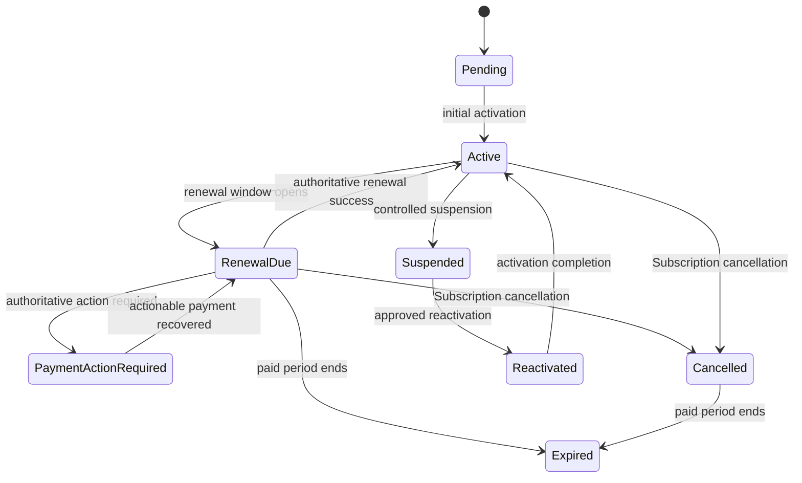
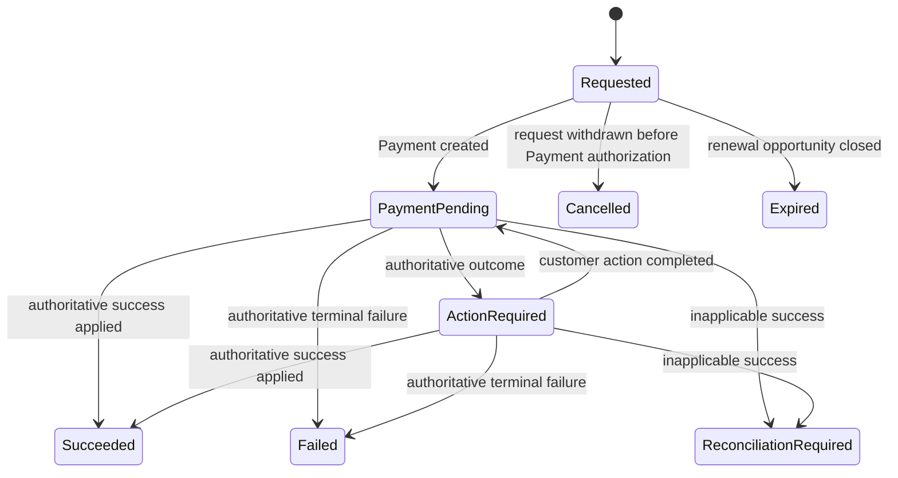
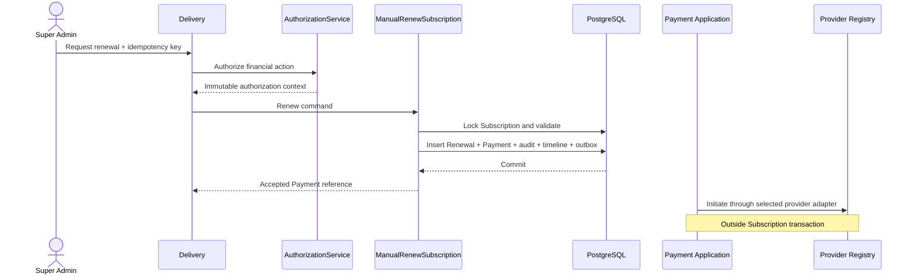
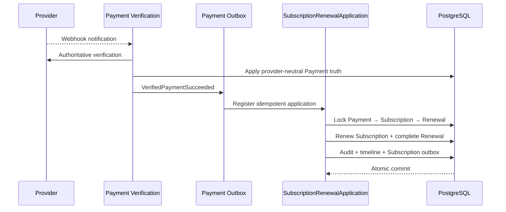
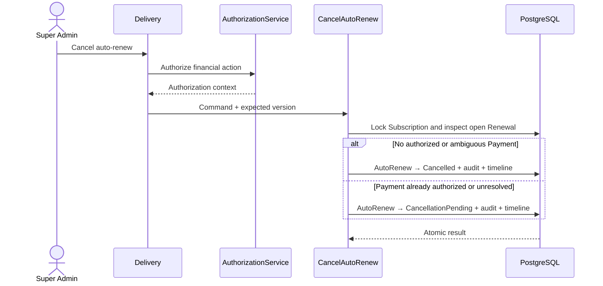

# ADR-032: Billing Renewal Domain

## Status

Accepted.

## Date

2026-07-23

## Decision Owner

Chief Technology Officer

## Context

[ADR-011](./ADR-011-Initial-Subscription-Activation.md) establishes one
Subscription lifecycle aggregate per Tenant, preserves its first
`payment_id` as immutable activation lineage, and explicitly reserves renewal
payment identity for a later decision. The current Subscription aggregate can
mark renewal due and replace its commercial period after renewal, but there is
no approved workflow for requesting a renewal, associating a later Payment,
applying authoritative success, controlling automatic renewal, or projecting a
financially authoritative timeline.

Sprint 12 also requires a Subscription detail read model, payment history and
operational actions. Those capabilities cannot safely be inferred from the
initial activation row. This ADR defines their provider-neutral Domain and
Application boundaries. It does not authorize UI, provider API calls or
implementation.

## Decision Summary

1. A successful renewal extends the existing Subscription aggregate. It never
   creates a replacement Subscription.
2. `SubscriptionRenewal` is a normalized internal entity owned by Subscription,
   not a new Aggregate Root.
3. Every renewal has one immutable `RenewalId` and one immutable `PaymentId`.
   Payment records an opaque renewal obligation correlation. PaymentAttempt
   remains owned by Payment and permanently bound to its original provider.
4. Subscription keeps its existing persisted lifecycle vocabulary. `Expiring`
   and `Renewing` are read-model conditions, not stored Subscription states.
   No generic grace-period state is introduced.
5. Manual and automatic renewal use the same provider-neutral renewal
   orchestration. They differ only by initiation actor and idempotency source.
6. Auto-renew is explicit Subscription-owned policy state. Cancelling
   auto-renew does not cancel the current Subscription or an already-authorized
   Payment.
7. Renewal application, Subscription mutation, audit, timeline and outbox
   writes are transactional and idempotent.
8. Invoice is Phase 2. Sprint 12 must not fabricate an Invoice list or infer
   invoices from Payments.

## Domain Model

### Subscription

Subscription remains the Aggregate Root and retains the immutable activation
lineage accepted by ADR-011:

- `SubscriptionId`
- `TenantId`
- `ClinicRegistrationId`
- initial `PaymentId`
- initial `CommercialOfferId`

Renewal never replaces those identifiers. The existing row advances its
commercial period, price snapshot, entitlement and optimistic version only
after an authoritative successful renewal Payment is eligible to apply.

### SubscriptionRenewal

`SubscriptionRenewal` is an internal Subscription entity with:

- `RenewalId`
- `SubscriptionId`
- `TenantId`
- `PaymentId`
- `CommercialOfferId`
- `RenewalMode` (`manual` or `automatic`)
- `RenewalStatus`
- proposed `PlanId`
- proposed `BillingCycleId`
- proposed amount and currency
- proposed `starts_on` and `ends_on`
- immutable request idempotency key
- requested actor type and opaque actor identifier
- requested, last-changed and terminal timestamps
- optimistic version

The proposed period must begin exactly one calendar day after the current
Subscription period ends. The annual term uses ADR-011's calendar-anniversary
algorithm. The entity cannot exist independently, cannot be moved between
Subscriptions, and cannot change its Payment.

Every Renewal uses a newly issued immutable CommercialOffer snapshot. The
initial CommercialOffer is never reused or rewritten. ADR-006 continues to own
offer construction and eligibility; SubscriptionBilling consumes the snapshot
through its existing Commercial contract.

### Payment obligation correlation

Payment remains a separate Aggregate Root. It gains provider-neutral obligation
correlation:

- `obligation_type = subscription_initial_activation | subscription_renewal`
- `obligation_id`

For renewal, `obligation_id` is the opaque `RenewalId`. The corresponding
`subscription_renewals.payment_id` is unique and immutable. This two-sided
database correlation allows an authoritative Payment outcome to resolve its
renewal without provider data entering Subscription.

PaymentAttempt remains unchanged:

```text
Subscription
  └─ SubscriptionRenewal (internal entity)
       └─ Payment (immutable obligation correlation)
            └─ PaymentAttempt (immutable provider binding)
                 └─ provider payment reference
```

No provider key, SDK type, webhook payload or provider response is stored in
Subscription or SubscriptionRenewal.

## Subscription Lifecycle

The existing Subscription states remain authoritative:

- `Pending`
- `Active`
- `PaymentActionRequired`
- `Restricted`
- `RenewalDue`
- `Cancelled`
- `Expired`
- `Suspended`
- `Reactivated`

The following requested terms are projections, not new persisted states:

- **Expiring:** `Active` and within the governed renewal window.
- **Renewing:** an open SubscriptionRenewal exists.
- **Grace period:** not approved. Where commercial policy later allows limited
  access after non-payment, the existing `Restricted` state is used only after
  that policy is separately defined. This ADR does not invent its duration.

Renewal may be requested only while Subscription is `RenewalDue`. A renewal
request or pending Payment does not change Subscription. Authoritative renewal
success changes `RenewalDue → Active` and replaces the current commercial
period atomically. A failed Payment leaves the Subscription `RenewalDue` until
the existing period expires. `PaymentActionRequired` may be applied only from
an authoritative action-required Payment outcome through the renewal
application; timeout or transport failure alone cannot cause it.

Cancellation of auto-renew is distinct from `Subscription::cancel()`. A
cancelled Subscription continues through its already-paid inclusive term and
cannot start a new renewal.



## Renewal Lifecycle

`RenewalStatus` is:

- `requested`
- `payment_pending`
- `action_required`
- `succeeded`
- `failed`
- `cancelled`
- `expired`
- `reconciliation_required`

`requested`, `payment_pending` and `action_required` are open. All other states
are terminal. A terminal Renewal is never reopened or rewritten; a later
authorized attempt creates a new Renewal with a new Payment and idempotency
key. Exactly one open Renewal may exist for a Subscription.

`failed` requires an authoritative terminal Payment failure. Provider timeout,
unavailability or malformed response remains inside Payment verification retry
and quarantine policy and cannot become renewal failure by inference.
`expired` means the renewal opportunity ended before applicable success.
Authoritative success that arrives after a terminal or superseding condition
opens a reconciliation case and appends
`renewal_reconciliation_required` to the timeline; the terminal Renewal status
is preserved and Subscription is never silently extended.



## Auto-Renew

`AutoRenewStatus` is Subscription-owned:

- `disabled`: never enabled or administratively disabled without an active
  cancellation history;
- `enabled`: eligible automatic renewal may be requested;
- `cancellation_pending`: cancellation was requested while a Payment was
  already authorized or its outcome is unresolved;
- `cancelled`: automatic renewal was explicitly cancelled;
- `failed`: the automatic Renewal reached authoritative terminal failure and
  automatic charging is stopped pending an explicit enable operation.

Enabling auto-renew records explicit consent, actor, timestamp and optimistic
Subscription version. It does not contact a provider and does not guarantee
that the selected provider supports an off-session payment method. Provider
capability is checked later through provider-neutral Payment initiation.

Cancelling while no Renewal Payment is authorized changes the state directly
to `cancelled`. If a Payment is already authorized or ambiguous, it changes to
`cancellation_pending`; the system must finish authoritative Payment
verification and then either reconcile success or settle the policy as
`cancelled`. Cancellation never deletes a Renewal or Payment and never breaks
verification or webhooks.

Automatic initiation uses the same operation as manual initiation with a
system actor and deterministic idempotency key:

```text
subscription-renewal:{subscription_id}:{next_starts_on}
```

This ADR defines the behavior but does not implement the scheduler or worker.

## Manual Renewal

Manual renewal is a Super Admin-controlled financial operation in Sprint 12.
Clinic Owner renewal remains a future Delivery increment using the same
Application contract and tenant-scoped authorization.

The command requires:

- `SubscriptionId`
- opaque authenticated actor identity and actor type
- idempotency key
- expected Subscription version
- audit correlation identifier

The operation fails closed unless the Subscription exists, the actor is
authorized, status is `RenewalDue`, the proposed offering remains renewal
eligible, no open Renewal exists, and the next period is contiguous.

The same `(subscription_id, idempotency_key)` returns the original result.
Reuse of the key with different normalized input is a conflict. Concurrent
different keys serialize on the Subscription row; at most one open Renewal and
one Payment are created.

## Idempotency, Concurrency and Transactions

### Request transaction

> **Refined by ADR-033:** the conceptual effects listed below do not execute in
> one cross-module transaction. CommercialOffer issuance, Renewal creation and
> Payment/PaymentAttempt creation use three idempotent local transactions
> coordinated by a durable `RenewalCheckoutApplication`. See
> [ADR-033](./ADR-033-Renewal-Commercial-Offer-Resolution.md) for the
> authoritative request and PaymentSession boundary.

The renewal-request transaction:

1. locks Subscription;
2. revalidates status, expected version and auto-renew policy;
3. resolves an immutable renewal-eligible commercial snapshot;
4. creates SubscriptionRenewal;
5. creates Payment with renewal obligation correlation;
6. appends timeline and financial audit entries;
7. writes required transactional outbox rows;
8. commits.

Provider initiation occurs after commit through the existing Payment
Application and provider registry. No provider call occurs while a database
transaction or Subscription lock is held.

### Authoritative outcome transaction

The renewal-application transaction uses the global financial lock order:

1. Payment;
2. Subscription;
3. SubscriptionRenewal.

It revalidates Payment amount, currency, obligation correlation, current
Subscription period/version and Renewal status. On applicable success it
renews Subscription, completes Renewal, appends timeline and financial audit,
and writes outbox rows in one commit.

A durable one-to-one `SubscriptionRenewalApplication`, keyed uniquely by the
authoritative Payment source event and Payment, uses opaque claim tokens,
leases and bounded retry following ADR-010/011. Duplicate workers, expired
leases and stale expected versions cannot repeat a financial effect. A stale
or inapplicable success opens one unique renewal reconciliation case.

## Authoritative Renewal Timeline

`SubscriptionTimelineEntry` is an append-only, normalized financial projection.
It is not a replacement event store and is not used to reconstitute
Subscription. Every entry has:

- `timeline_entry_id`
- `subscription_id`
- optional `renewal_id`
- optional `payment_id`
- governed event type
- opaque actor type and identifier
- safe result/reason code
- `occurred_at`
- audit correlation identifier

Approved event types are:

- `subscription_activated`
- `renewal_due`
- `renewal_requested`
- `renewal_payment_pending`
- `renewal_action_required`
- `renewal_succeeded`
- `renewal_failed`
- `renewal_expired`
- `renewal_reconciliation_required`
- `auto_renew_enabled`
- `auto_renew_cancellation_pending`
- `auto_renew_cancelled`
- `subscription_cancelled`
- `subscription_expired`

Timeline rows are written in the same transaction as their authoritative state
change. They contain no raw webhook data, provider response, credential,
authorization header, signature or SDK object. Financial `AuditEntry` remains
separate and mandatory for operations; timeline is the safe operational
history shown to authorized users.

Renewal success also records a distinct `SubscriptionRenewed` Domain event and
provider-neutral integration event. It must not reuse
`SubscriptionActivated`, because activation and renewal have different
financial lineage and consumers must not infer the difference from dates.

## Billing Read Contracts

Contracts live in SubscriptionBilling `Contracts/` and return immutable
provider-neutral DTOs. Implementations may use optimized SQL projections but
never expose ORM models, aggregates or provider objects.

### `BillingOverviewReadInterface`

Retained as the portfolio-level summary/list contract. It exposes derived
counts, recorded succeeded-Payment revenue, recent Payments, billing health
and cursor-paginated Subscription summaries.

### `SubscriptionDetailReadInterface`

```text
detail(subscription_id) -> SubscriptionDetailData | null
```

The result includes immutable identifiers, current Plan/Billing Cycle,
commercial period, amount/currency, Subscription status, derived expiring and
renewing flags, AutoRenew status, current Renewal summary and optimistic
version.

### `SubscriptionTimelineReadInterface`

```text
list(subscription_id, cursor?, limit) -> CursorPage<SubscriptionTimelineData>
```

Orders by `(occurred_at DESC, timeline_entry_id DESC)`. The cursor is opaque.

### `PaymentHistoryReadInterface`

```text
listForSubscription(subscription_id, cursor?, limit)
    -> CursorPage<SubscriptionPaymentData>
```

Includes the initial activation Payment and renewal Payments resolved through
obligation correlation. It exposes provider-neutral amount, currency, status,
purpose and timestamps only.

No `InvoiceReadInterface` is approved in Phase 1.

## Billing Operation Contracts

Application contracts consume immutable commands and return closed,
provider-neutral results. They do not return aggregates, ORM models, SDK
objects or provider responses.

### `ManualRenewSubscriptionInterface`

```text
renew(ManualRenewSubscriptionCommand) -> RenewalOperationResult
```

Result codes: `accepted`, `already_accepted`, `not_found`, `not_eligible`,
`version_conflict`, `idempotency_conflict`, `authorization_denied`,
`reconciliation_required`.

### `CancelAutoRenewInterface`

```text
cancel(CancelAutoRenewCommand) -> AutoRenewOperationResult
```

Result codes: `cancelled`, `cancellation_pending`, `already_cancelled`,
`not_found`, `version_conflict`, `authorization_denied`.

### `EnableAutoRenewInterface`

```text
enable(EnableAutoRenewCommand) -> AutoRenewOperationResult
```

Result codes: `enabled`, `already_enabled`, `not_supported`, `not_found`,
`version_conflict`, `authorization_denied`.

AuthorizationService remains the authorization entry point. Delivery supplies
only its trusted immutable authorization context; Controllers do not inspect
roles or permissions and Billing operations revalidate the approved
financial-action authority.

## Sequence Diagrams

### Manual renewal request



### Authoritative renewal success



### Cancel auto-renew



## Invoice Decision

Invoice is **Phase 2**, not Phase 1 MVP.

The current Domain Model explicitly marks Invoice behavior provisional, and
[Payment Architecture Design](../31_PAYMENT_ARCHITECTURE_DESIGN.md) excludes
invoice lifecycle and accounting documents. Payment and renewal records must
not be relabelled as invoices. Sprint 12 may show Payment history but must omit
the Invoice list entirely; an “empty” or fabricated Invoice list would falsely
represent an unavailable financial capability.

A future Invoice ADR must decide legal numbering, issuance, taxation, customer
identity, correction/void policy, retention and accounting authority before
any Invoice entity, table, contract or UI is introduced.

## Persistence and Migration Impact

Implementation requires additive, production-safe migrations:

1. `subscription_renewals` with immutable lineage, proposed commercial
   snapshot, lifecycle, timestamps and optimistic version;
2. `subscription_renewal_applications` with unique source event and Payment,
   claim/lease/retry metadata and terminal result;
3. `subscription_renewal_reconciliation_cases` with one open case per
   inapplicable success;
4. `subscription_timeline_entries`, append-only and cursor indexed;
5. additive Payment obligation type/id columns with a unique partial index for
   renewal obligation correlation;
6. additive Subscription AutoRenew status, consent/cancellation timestamps and
   optimistic-version participation.

Required constraints include:

- `UNIQUE(subscription_id, request_idempotency_key)`;
- `UNIQUE(payment_id)` on SubscriptionRenewal;
- `UNIQUE(obligation_type, obligation_id)` on Payment where obligation is not
  null;
- a partial unique index allowing one open Renewal per Subscription;
- check constraints for closed status vocabularies, positive amount/version and
  contiguous period evidence;
- indexes for timeline and payment-history cursor queries.

Existing Subscription `payment_id` remains untouched and continues to mean
initial activation Payment. Existing rows receive `auto_renew_status =
disabled`; no consent is inferred. Payment obligation columns remain nullable
for legacy Payments and are backfilled only where lineage is deterministic.
No migration fabricates renewal, consent, timeline or Invoice history.

## Compatibility with Provider Abstraction

ADR-009 remains unchanged:

- Renewal chooses a currently enabled provider only when creating a new
  PaymentAttempt.
- Every PaymentAttempt remains permanently bound to that provider.
- Disabling a provider stops new attempts but does not affect existing renewal
  verification or webhooks.
- Renewal consumes only provider-neutral authoritative Payment outcomes.
- Subscription never selects an adapter, stores credentials, calls a provider
  or performs failover.
- No automatic cross-provider failover is introduced. A separately authorized
  retry creates a new PaymentAttempt under existing Payment rules.

Auto-renew is a commercial intention, not proof that a provider supports
off-session charging. Unsupported provider capability returns `not_supported`
without mutating Subscription or fabricating success.

## Risks and Mitigations

| Risk | Mitigation |
|---|---|
| Duplicate charge from concurrent renewal requests | Subscription lock, request idempotency, one-open-Renewal constraint and Payment idempotency |
| Late Payment success extends an ineligible term | Revalidate Payment → Subscription → Renewal under lock; open reconciliation instead of applying |
| Provider outage incorrectly fails renewal | Only authoritative terminal Payment truth may fail Renewal |
| Auto-renew cancellation races an authorized Payment | `cancellation_pending`, continued verification and explicit reconciliation |
| Historic activation lineage is overwritten | Existing `subscriptions.payment_id` remains immutable; renewals use normalized child rows |
| Dashboard derives financial truth independently | Read contracts project normalized Billing data only |
| Timeline diverges from aggregate state | State, audit, timeline and outbox writes share one transaction |
| Auto-renew consent is inferred during migration | Existing records default to `disabled`; enable requires explicit audited action |
| Invoice vocabulary becomes accidental accounting behavior | Invoice is explicitly Phase 2 and has no Phase 1 contract or table |

## Consequences

Sprint 12 may implement Subscription detail, renewal/auto-renew status,
authoritative timeline, Payment history, manual renewal, cancel auto-renew and
immutable operational actions after the persistence and Application contracts
defined here exist. It must remove Invoice list from its Phase 1 acceptance
criteria.

Implementation is larger than a Dashboard increment because renewal introduces
a financially consequential Domain entity, durable application, Payment
correlation, reconciliation, audit and migrations. These must be implemented
and verified before the Dashboard exposes actions.

## Relationship to Earlier Decisions

- ADR-011's one-Subscription-per-Tenant decision is completed, not superseded.
  Its initial `payment_id` lineage remains immutable.
- ADR-010's authoritative Payment application, lease, reconciliation and
  transactional-outbox patterns are reused.
- ADR-009's registry, readiness rules, immutable PaymentAttempt provider
  binding and no-failover rule remain unchanged.
- ADR-008's provider-specific selection and validation remain Infrastructure
  concerns.
- ADR-006 continues to own immutable CommercialOffer checkout snapshots.
- Invoice deferral resolves, rather than overrides, the open question in the
  Domain Model and Payment Architecture Design.
