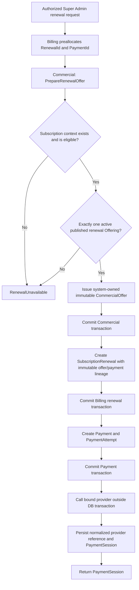
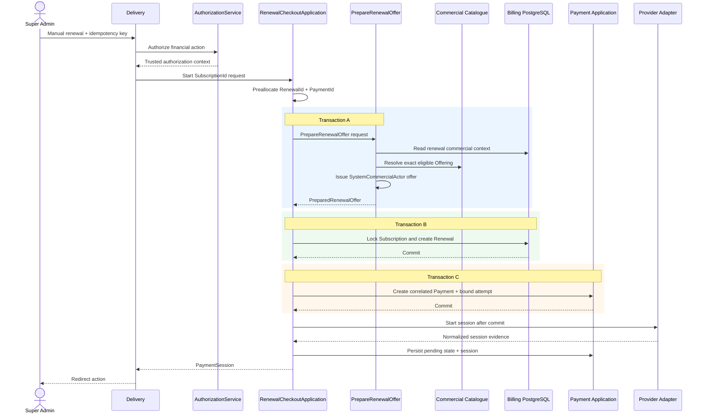

# ADR-033: Renewal Commercial Offer Resolution

## Status

Accepted.

Amended by Addendum A on 2026-07-23.

## Date

2026-07-23

## Decision Owner

Chief Technology Officer

## Context

[ADR-032](./ADR-032-Billing-Renewal-Domain.md) requires every Subscription
Renewal to use a newly issued immutable CommercialOffer and forbids Billing
from selecting provider behavior. The existing Commercial offer-preparation
entry point is Clinic-Registration onboarding-oriented: its caller supplies a
`PlanOfferingId`, and the offer is owned by the Platform Identity associated
with that registration. Those rules cannot be reused for a Super
Admin-initiated renewal without exposing Commercial catalogue selection to
Billing or pretending that the administrator owns the Clinic Registration.

This ADR defines a renewal-specific anti-corruption boundary. Commercial
remains the only owner of offer generation and catalogue resolution. Billing
supplies only an opaque `SubscriptionId`; neither Billing Domain nor Delivery
selects a `PlanOfferingId`.

## Decision Summary

1. A trusted `SystemCommercialActor` prepares renewal offers. The Super Admin
   initiates and authorizes the workflow but never becomes the CommercialOffer
   owner.
2. Billing calls `PrepareRenewalOfferInterface` using only opaque identifiers,
   idempotency and audit context.
3. Commercial obtains the Subscription's current commercial context through a
   narrow Billing-owned read contract, then resolves the single active,
   published, renewal-eligible Offering for the current Plan and Billing Cycle.
4. Zero or multiple eligible Offerings fail closed as `RenewalUnavailable`.
5. CommercialOffer issuance, SubscriptionRenewal creation, Payment/attempt
   creation and provider session completion use independent local
   transactions. No distributed transaction is introduced.
6. Preallocated immutable `RenewalId` and `PaymentId` preserve lineage across
   those commits.
7. Billing exposes only a normalized `PaymentSession`; provider payloads and
   provider-specific session types remain in Infrastructure.

## Actor Model

### Initiating actor

The authenticated Super Admin is the **initiating actor**. AuthorizationService
must approve the governed financial action before the Application operation is
called. The initiator's opaque Platform Identity ID and the request correlation
ID are recorded in Billing's audit and renewal timeline.

The initiating actor:

- does not own the CommercialOffer;
- does not impersonate the Clinic Owner;
- does not select a PlanOffering;
- does not supply price, currency, period or provider;
- cannot bypass Commercial eligibility.

### SystemCommercialActor

`SystemCommercialActor` is a governed Application actor representing the
platform's automated Commercial process. It is not a human Platform Identity,
Domain Participant, Tenant authority, or synthetic Clinic Owner. It carries no
login credential and cannot authenticate.

CommercialOffer gains an explicit owner-kind distinction:

- `platform_identity` for existing onboarding offers;
- `system_commercial` for renewal offers.

A system-owned renewal offer additionally records safe provenance:

- purpose `subscription_renewal`;
- opaque `SubscriptionId`;
- initiating actor ID for audit attribution only;
- correlation ID.

The offer's commercial owner is `system_commercial`; the audit record retains
the initiating Super Admin separately. Existing onboarding offer ownership and
authorization remain unchanged.

## Cross-Module Contracts

Only immutable primitive DTOs cross module boundaries. No module imports
another module's Domain object, repository, ORM model or value object.

### Billing-owned context contract

Billing publishes:

```text
RenewalCommercialContextReadInterface

currentForRenewal(subscription_id)
    -> RenewalCommercialContextData | null
```

`RenewalCommercialContextData` contains:

- `subscription_id`
- `tenant_id`
- `clinic_registration_id`
- current `plan_id`
- current `billing_cycle_id`
- current `ends_on`
- Subscription status
- optimistic Subscription version

It intentionally excludes price and `PlanOfferingId`. This is a read contract,
not authorization to mutate Subscription.

Commercial's renewal-offer adapter may consume this Billing contract. This is a
Contracts-to-Contracts collaboration only; Commercial Domain remains
independent of Billing Domain.

### Commercial-owned renewal preparation contract

Commercial publishes:

```text
PrepareRenewalOfferInterface

prepare(PrepareRenewalOfferRequest)
    -> PreparedRenewalOffer | RenewalUnavailable
```

`PrepareRenewalOfferRequest` contains:

- `subscription_id`
- `renewal_id`
- `payment_id`
- request idempotency key
- initiating actor ID
- occurred-at timestamp
- correlation ID

Billing still requests conceptually `PrepareRenewalOffer(SubscriptionId)`;
the additional opaque identifiers are workflow identity and audit metadata,
not catalogue selection.

`PreparedRenewalOffer` contains:

- `commercial_offer_id`
- `subscription_id`
- resolved `plan_id`
- resolved `billing_cycle_id`
- amount in minor units
- ISO currency
- valid-from and expires-at timestamps
- proposed `starts_on` and `ends_on`
- immutable offering-configuration reference

It contains no provider key, provider reference, SDK object, checkout payload,
secret or `PlanOfferingId`.

`RenewalUnavailable` contains one closed reason:

- `subscription_not_found`
- `subscription_not_eligible`
- `offering_not_found`
- `offering_ambiguous`
- `offering_not_renewal_eligible`
- `currency_not_supported`
- `commercial_configuration_invalid`

Internal identifiers or catalogue details are not exposed in failure text.

### Offering resolution

Commercial performs the resolution:

1. load `RenewalCommercialContextData`;
2. require the Subscription to be renewal-eligible under ADR-032;
3. query the governed Commercial Catalogue for an active, published,
   renewal-eligible Offering matching the exact current `PlanId` and
   `BillingCycleId` at the requested effective date;
4. require exactly one result;
5. calculate the contiguous next period using ADR-011's anniversary rule;
6. snapshot price, currency, capability configuration and offering version;
7. issue a system-owned CommercialOffer.

Commercial never accepts “first match”, latest-created or lowest-price as an
ambiguity rule. Zero or multiple candidates fail closed.

### Payment session contract

Billing publishes a provider-neutral result:

```text
PaymentSession

- session_id
- redirect_action
- expires_at (nullable)
- expiry_authority
```

`session_id` is a Billing-generated opaque identifier, not a provider session
ID. `redirect_action` is a normalized action with:

- kind `redirect`;
- an absolute HTTPS destination;
- method `GET`.

The destination may point to a provider-hosted page, but its shape is opaque to
Billing Domain and Delivery. No headers, form fields, provider key, raw
response or SDK object is exposed.

The Payment Infrastructure adapter translates Stripe Checkout, a ToyyibPay
bill URL or any future provider response into an internal normalized session
result. Billing Application maps that result to `PaymentSession`.

The provider contract therefore requires an additive session-capable result;
existing authoritative verification and immutable PaymentAttempt binding are
unchanged.

### Addendum A: expiry authority

`ExpiryAuthority` is a closed provider-neutral enum:

- `provider`
- `commercial_offer`
- `none`

Expiry is resolved in this order:

1. If the provider supplies an authoritative expiry, `expires_at` is that
   instant and `expiry_authority = provider`. Stripe Checkout is the Phase 1
   example.
2. If the provider does not expose an authoritative expiry but the immutable
   CommercialOffer has `valid_until`, `expires_at` is that instant and
   `expiry_authority = commercial_offer`. ToyyibPay is the Phase 1 example.
3. If neither source exists, no usable session is returned. The result is
   `PaymentSessionUnavailable` with a safe reason code and the operation fails
   closed.

`expiry_authority = none` is retained for normalized unavailable-session
evidence and diagnostics. A successful PaymentSession with
`expiry_authority = none` is invalid. `expires_at` is nullable only because the
unavailable result has no expiry; when authority is `provider` or
`commercial_offer`, it must be present.

CommercialOffer validity is a safe navigation bound, not a claim about a
provider's internal session lifetime. Authoritative Payment status continues
to come only from provider verification.

### Addendum A: redirect validation

Provider adapters alone construct or extract redirect destinations. Before
returning normalized session evidence, every adapter must require:

- an absolute URL;
- the `https` scheme;
- no embedded username or password;
- a host on that adapter's explicit configuration allowlist;
- a host matching the expected provider domain for the active environment.

Redirect allowlists are trusted Infrastructure configuration, never request,
CommercialOffer or tenant input. Wildcard suffix checks that allow lookalike
hosts are prohibited; matching is exact or against an explicitly enumerated
subdomain set. Redirects are not followed server-side during validation.

An invalid, missing or unapproved destination returns
`PaymentSessionUnavailable`; it is never passed through to Delivery, logged
with query parameters, or reconstructed by Billing. Billing returns only the
normalized redirect action and never returns provider payloads, SDK objects,
response JSON or provider headers.

## Renewal Resolution Flow



## Transaction Model

There is no cross-module or provider-spanning database transaction.

### Transaction A: CommercialOffer issuance

Commercial:

1. resolves Billing renewal context;
2. resolves exactly one eligible Offering;
3. inserts the immutable, system-owned CommercialOffer;
4. writes Commercial audit and outbox evidence;
5. commits.

Uniqueness on `(purpose, subscription_id, request_idempotency_key)` returns the
same offer for an identical retry. Reuse with different workflow identifiers
is an idempotency conflict.

### Transaction B: SubscriptionRenewal creation

Billing:

1. locks Subscription;
2. revalidates status/version and the returned offer's Subscription lineage;
3. verifies offer validity, Plan, Billing Cycle, currency and contiguous term;
4. creates SubscriptionRenewal using the preallocated immutable `RenewalId`
   and `PaymentId`;
5. appends audit, `renewal_requested` timeline and outbox evidence;
6. commits.

If Transaction B fails after A commits, the unused offer remains immutable and
expires naturally. A retry reuses it; no compensating delete or rollback is
allowed.

### Transaction C: Payment and PaymentAttempt creation

Payment:

1. creates Payment with the preallocated `PaymentId`, CommercialOffer and
   `subscription_renewal/RenewalId` obligation correlation;
2. claims the CommercialOffer;
3. selects the current default ready provider for the new attempt;
4. creates PaymentAttempt with immutable provider binding;
5. records Payment audit/outbox evidence;
6. commits.

The provider is not called inside Transaction C. If C fails, the Renewal stays
`requested`; a retry uses the same PaymentId and idempotency key.

### Provider session completion

After C commits:

1. Payment Infrastructure calls the bound provider using Payment idempotency;
2. validates the provider redirect and normalizes the response;
3. in a new local transaction, attaches the provider reference, marks Payment
   pending and persists PaymentSession metadata, including expiry authority;
4. appends `renewal_payment_pending`;
5. commits and returns PaymentSession.

Transport timeout leaves an existing attempt unresolved. The same attempt is
verified or retried according to Payment policy; Billing does not create an
automatic failover attempt.

Missing expiry evidence or an invalid redirect returns
`PaymentSessionUnavailable` and does not expose a redirect. It does not erase
the already-created PaymentAttempt or prevent its webhook and authoritative
verification paths.

### Durable workflow state

A provider-neutral `RenewalCheckoutApplication` records the stage:

- `offer_pending`
- `offer_prepared`
- `renewal_created`
- `payment_created`
- `session_pending`
- `session_ready`
- `failed`
- `cancelled`

It owns claim token, lease, retry count, next-attempt time and safe failure
reason. Every stage transition is idempotent and occurs in the same local
transaction as that stage's durable effect. It is orchestration state, not a
new Aggregate Root.

## Renewal Failure Model

Every failure is durable and produces a safe immutable Subscription timeline
entry. Timeline insertion occurs in the Billing transaction that records or
observes the failure; failures before Renewal creation are correlated through
the preallocated RenewalId and become visible once the Renewal exists, or
through the checkout-application audit if creation never becomes eligible.

| Failure | Durable outcome | Timeline event |
|---|---|---|
| Offer unavailable | Checkout application terminal; no Renewal or Payment | `renewal_offer_unavailable` |
| Offer expires before claim | Renewal `expired`; no new attempt without a new authorized request | `renewal_offer_expired` |
| Payment/session expires | Payment and Renewal follow authoritative expiry | `renewal_payment_expired` |
| Payment fails authoritatively | Renewal `failed`; Subscription is not extended | `renewal_failed` |
| Renewal cancelled before provider authorization | Renewal `cancelled`; Payment is cancelled if still legally cancellable | `renewal_cancelled` |
| Provider timeout or unknown result | Neither failure nor cancellation is inferred | `renewal_payment_verification_pending` |
| Late or inapplicable success | Renewal reconciliation case; no silent Subscription mutation | `renewal_reconciliation_required` |

Raw provider errors are never copied into timeline or audit. Safe governed
reason codes only.

## Sequence Diagram



## Compatibility Analysis

### ADR-032

ADR-032's one-Subscription rule, normalized SubscriptionRenewal entity,
immutable RenewalId/PaymentId correlation, authoritative outcome application,
timeline, audit and reconciliation rules remain unchanged.

This ADR narrowly supersedes ADR-032's **request transaction** description:
CommercialOffer issuance, Renewal creation and Payment/attempt creation are
independent commits coordinated by `RenewalCheckoutApplication`, not one
atomic cross-module transaction. ADR-032's authoritative renewal-outcome
transaction remains atomic.

### Provider abstraction

- Only Payment Infrastructure invokes adapters.
- New attempts use the registry's ready default provider.
- Every attempt is permanently bound to its chosen provider.
- Disabling a provider stops new attempts without breaking existing sessions,
  webhooks or verification.
- No automatic failover is introduced.
- PaymentSession is provider-neutral Delivery data, not Domain state.

### PaymentAttempt

PaymentAttempt remains an internal Payment entity. Its provider key and
provider reference never enter SubscriptionRenewal or CommercialOffer.
Preallocating PaymentId does not preselect a provider; binding happens only
when Transaction C creates the attempt.

### SubscriptionRenewal

The Renewal retains immutable CommercialOfferId and PaymentId across all
workflow retries. An orphaned prepared offer cannot mutate Subscription.
Renewal success still requires authoritative Payment evidence and ADR-032's
atomic outcome transaction.

### Future recurring billing

`SystemCommercialActor`, renewal offer resolution and Renewal lineage are
reusable for a future recurring scheduler. They do not assume an off-session
provider capability. A future recurring-billing ADR must define stored payment
authority, consent renewal, mandates and provider capability negotiation.
This ADR does not enable recurring charging.

## Risks and Mitigations

| Risk | Mitigation |
|---|---|
| Commercial and Billing become Domain-coupled | Primitive Contracts-only context query; no cross-module Domain imports |
| Catalogue ambiguity silently changes price | Exactly one eligible Offering or fail closed |
| Super Admin is falsely recorded as customer | SystemCommercialActor owns offer; initiator is separate audit provenance |
| Independent commits leave partial workflow | Durable staged application, immutable IDs, idempotent retries and natural offer expiry |
| Provider called while locks are held | Provider start occurs only after Transaction C commits |
| Duplicate provider sessions | Stable Payment/attempt idempotency and reuse of the same bound attempt |
| Provider URL leaks implementation details | Adapter-owned exact-host HTTPS validation and normalized redirect action only; no provider key/payload/headers |
| Provider omits session expiry | Use immutable CommercialOffer validity with explicit authority; fail closed if neither source exists |
| Offer expires between stages | Revalidate validity in B/C; record immutable expiry outcome |
| Circular module dependency | Collaboration is through explicit Contracts and an Infrastructure adapter; Domains remain independent |
| Future recurring work is accidentally implied | Off-session consent/mandates remain explicitly out of scope |

## Consequences

Sprint 12 can implement manual renewal without accepting `PlanOfferingId`,
price, currency or provider input. It must first implement the two cross-module
contracts, SystemCommercialActor offer ownership, durable checkout application,
preallocated identifiers and normalized PaymentSession result defined here.

The workflow accepts recoverable partial progress instead of a distributed
transaction. Operational monitoring must identify checkout applications whose
lease/retry budget is exhausted, but no external alerting dependency is
introduced by this ADR.

## Relationship to Earlier Decisions

- ADR-033 refines ADR-032 only for renewal offer/session orchestration and
  request transaction boundaries.
- ADR-006 remains authoritative for CommercialOffer snapshots and Commercial
  ownership.
- ADR-009 remains authoritative for provider registry behavior and immutable
  PaymentAttempt binding.
- ADR-010 remains authoritative for durable Payment verification and
  reconciliation.
- ADR-011 remains authoritative for Subscription identity and calendar term
  arithmetic.
